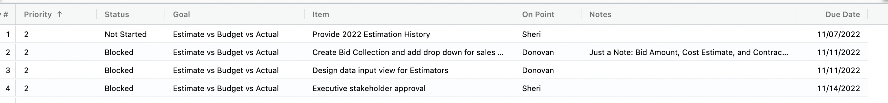
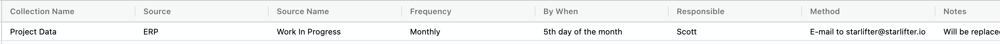

## Organization Admin Best Practices

1.  Add your **Configuration Plan** as a collection within StarLifter.  Here is an example of the fields added to the collection.  We recommend attaching each task to a goal and ordering those goals.  This will help you stay on target with your team.

</img>

2.  Add a collection for your **Data Sources**.  Here is an example of the fields added.  This collection will help any new organization administrator understand their role in data maintenance.  Plus, it is a great quick reference for you.

</img>

3.  As you add new organization administrators, point them to the **New Organization Admin** help desk article: [New Organization Admin](../how_to/newuser.md)
