## Create a chart

Select from multiple chart types to best visualize data.

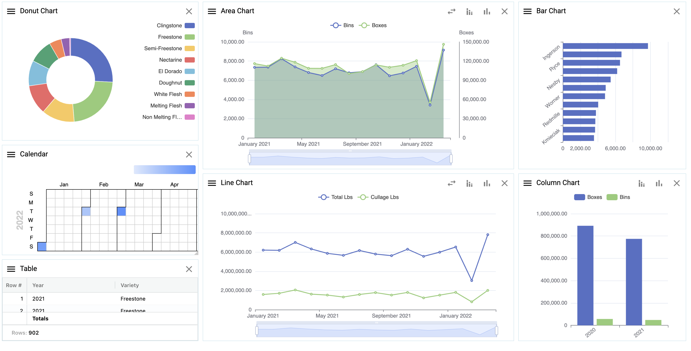</img>

### To create a chart:
1.  Right click ➔ **Create chart**

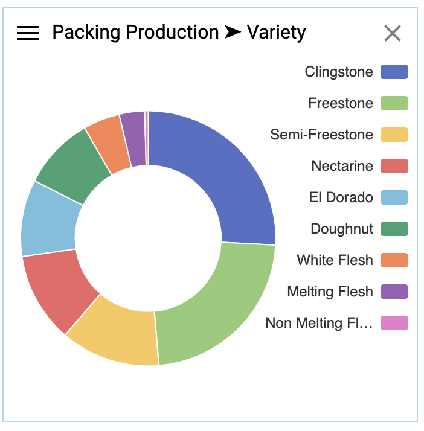</img>

### Good to know with charts: 

1.  Hover over data points on each chart to see tool tips

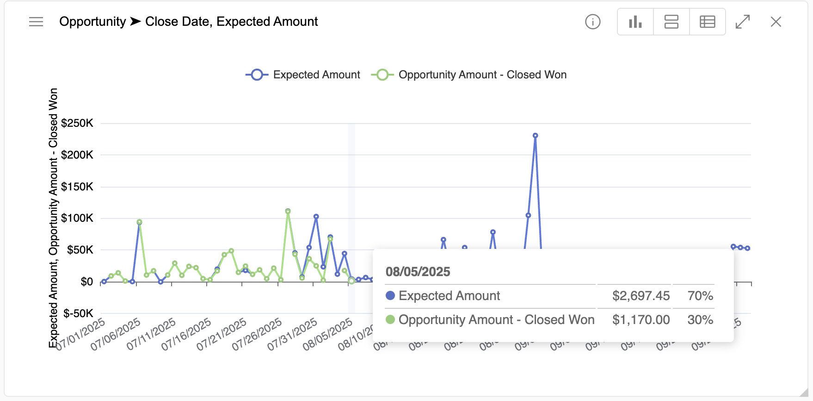</img>

2.  Change from grouped to stacked:

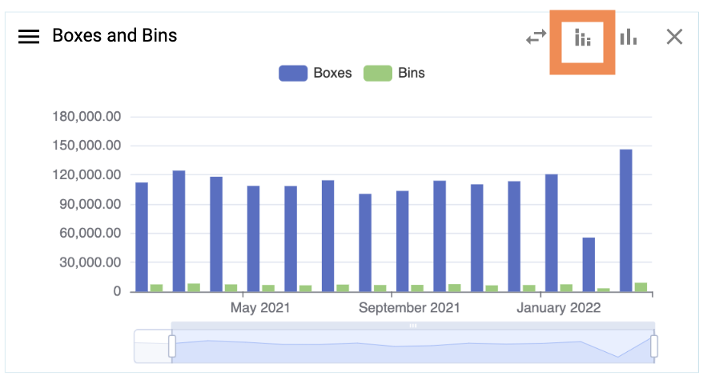</img>

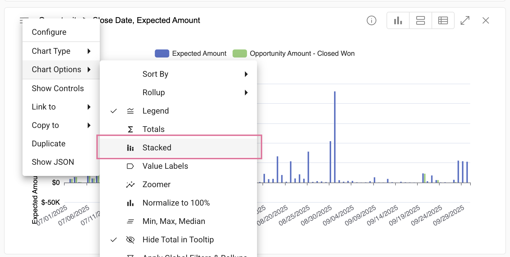</img>

3.  Normalize data to 100%:

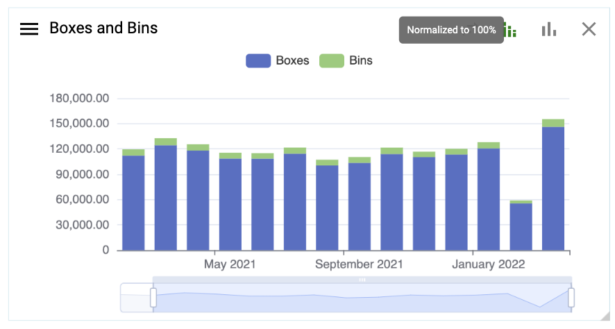</img>

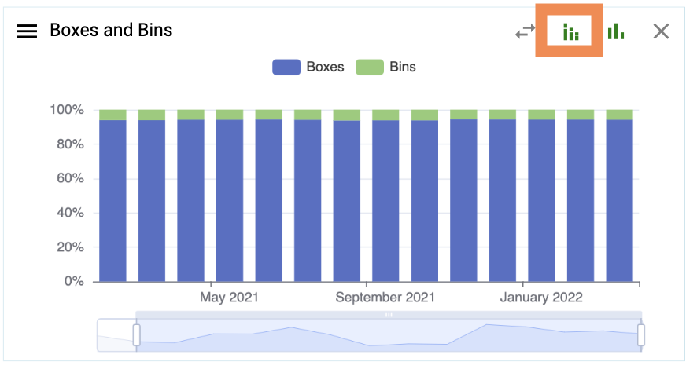</img>

4.  Add another Y axis or line

    Right click ➔ **Edit chart definition**

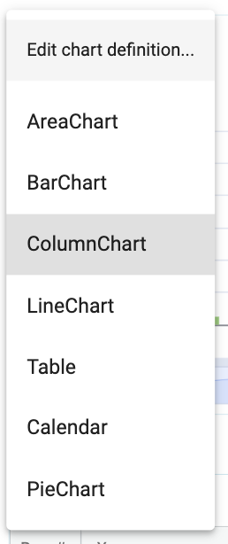</img>

Select the arrow for another Y axis and the line to add a line over the columns bars

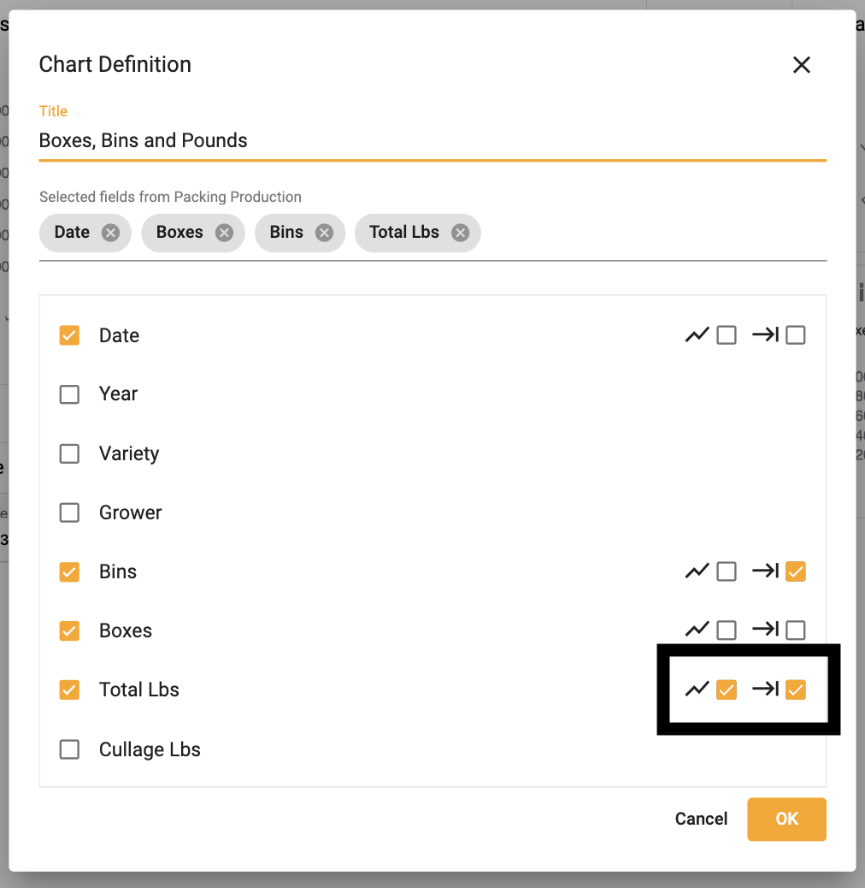</img>

5.  Compare to previous year:

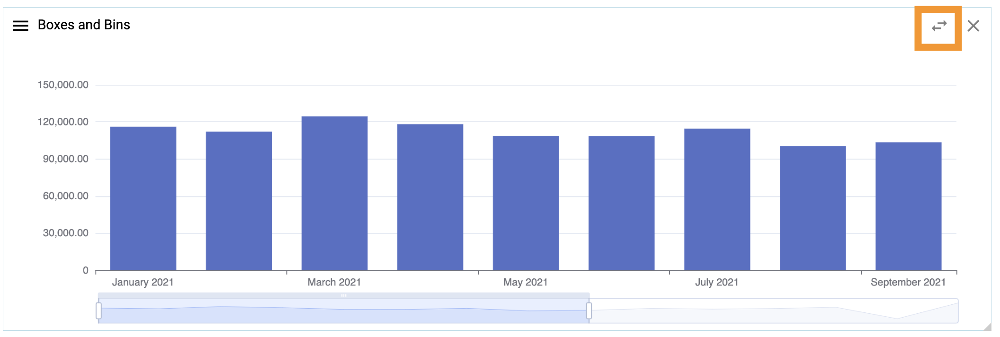</img>

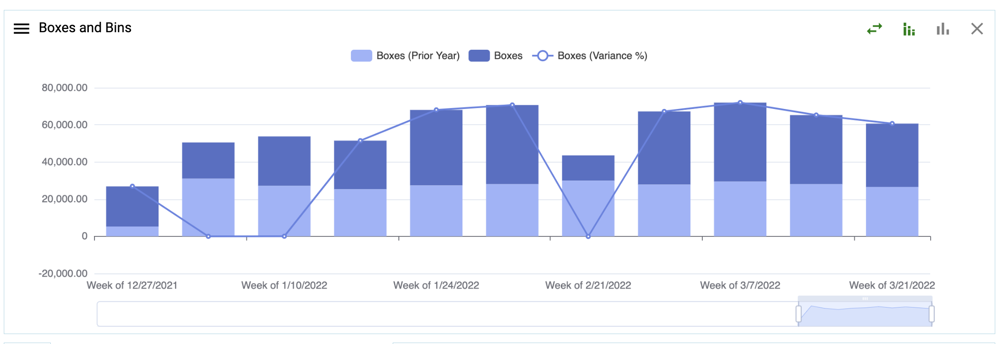</img>

5.  Add a horizontal zoomer:

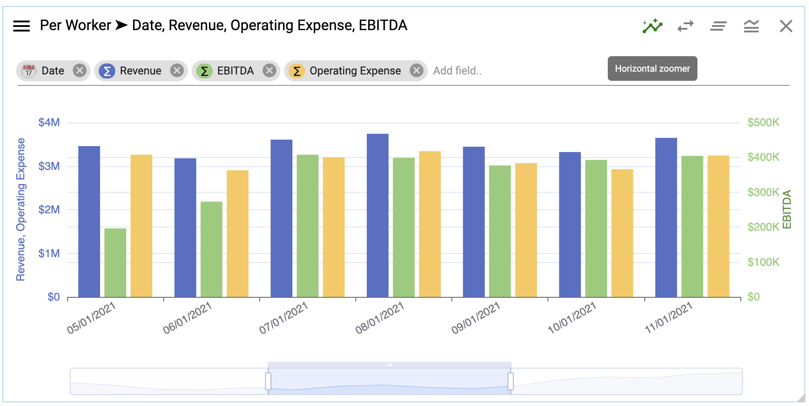</img>

6.  Add a Max, Medin, Mean lines:

</img>

6.  Add a filterable legend:

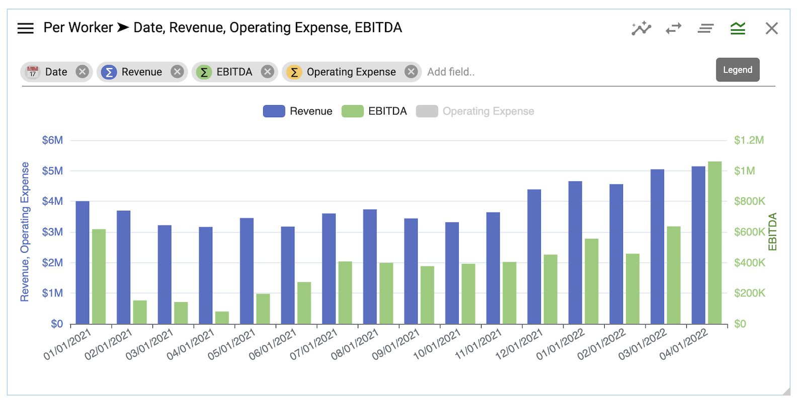</img>

