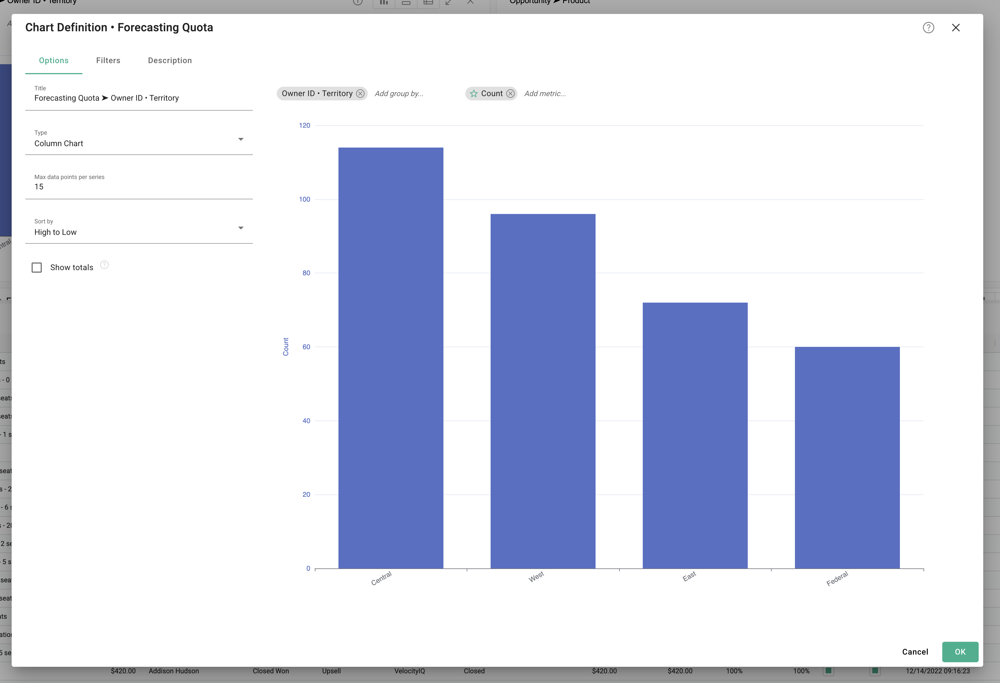
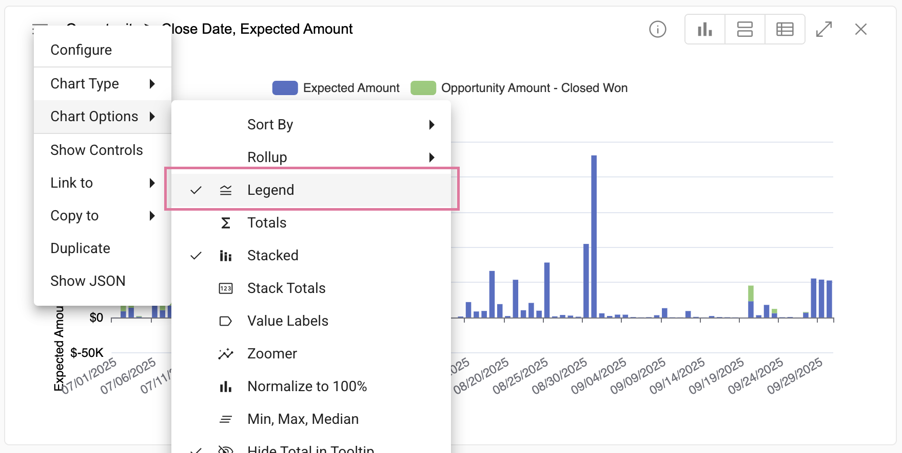

## Charts

<!-- [**Video Tutorial**](https://youtu.be/3Tnr53lELtI?feature=shared) -->

Select from multiple chart types to best visualize data.

</img>

### To create a chart
  Right click anywhere within the grid ➔ **Create chart**

</img>

### Edit a chart

#### Change the chart type
  Click the hamburger menu in the upper left of the chart and select a chart type.
  
  </img>  

#### Quick edit
  Click the **Add Metric..** input to quickly add metrics to the chart (y-axis).
  
</img>  

  Click the **Add Group by..** input to modify how chart values are grouped (x-axis).

</img>  a
 
 #### Configure the chart
  Click the menu in the upper left of the chart and select **Configure**
  
  </img>
   
   

  You will see a dialog with three tabs: **Options**, **Filters**, and **Description**

  </img>
  </img>
  </img>
  
### Good to know with charts

  Hover over data points on each chart to view more information.

</img>

  Change to stacked:

</img>

</img>

  Add a legend:

</img>