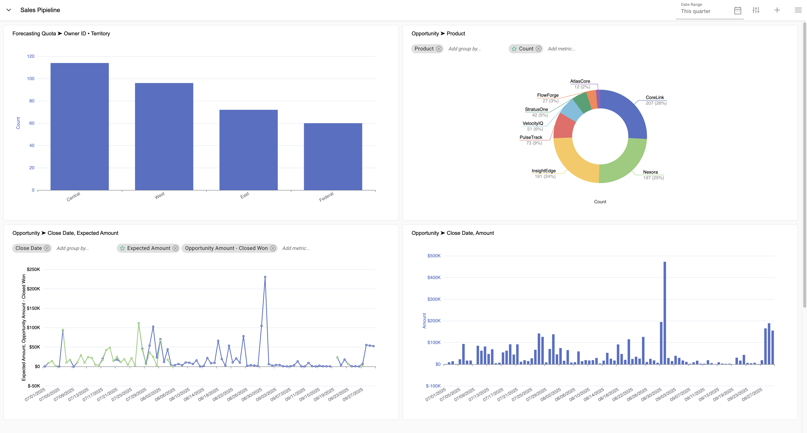
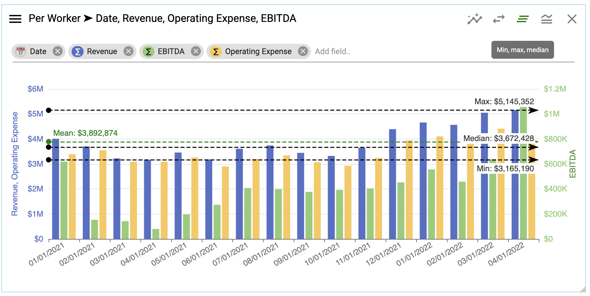

## Create a chart

Select from multiple chart types to best visualize data.

</img>

### To create a chart:
  Right click ➔ **Create chart**

</img>

### Good to know with charts: 

  Hover over data points on each chart to see tool tips

</img>

  Change from grouped to stacked:

</img>

</img>

  Normalize data to 100%:

</img>

</img>

  Compare to previous year:

</img>

</img>

  Add a horizontal zoomer:

</img>

  Add Max, Median, Mean lines:

</img>

  Add a filterable legend:

</img>

