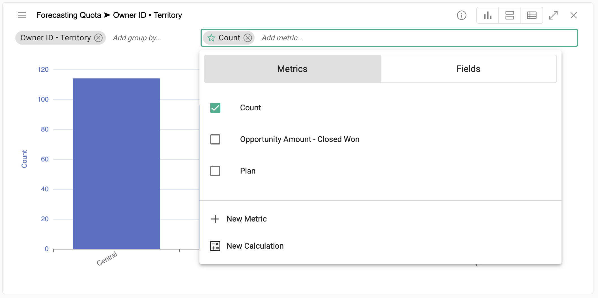
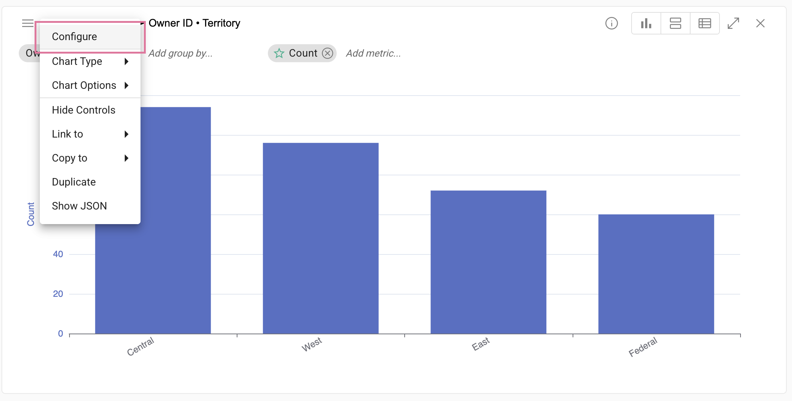

## Charts

[**Video Tutorial**](https://youtu.be/3Tnr53lELtI?feature=shared)

Select from multiple chart types to best visualize data.

</img>

### To create a chart
  Right click anywhere within the grid ➔ **Create chart**

</img>&nbsp;&nbsp;&nbsp;&nbsp;</img>

### Edit a chart

#### Change the chart type
  Click the hamburger menu in the upper left of the chart and select a chart type.
  
  </img>  

#### Quick edit
  Click the **Add Field..** icon to quickly add categories and measures to the chart.
  
</img>  
 
 #### Edit chart definition
  Click the hamburger menu in the upper left of the chart and select **Edit Chart Definition**
  
  </img>
  
  * Drag measures to the left or right vertical axes

    **NOTE:** If the right axis is not visible click on the dotted icon to drag the right axis menu into view
  * Drag categories to the horizontal **Categories** axis
  * Drag a measure to the **Line** box to overlay a line on a column chart
 
  </img>
  
### Good to know with charts

  Hover over data points on each chart to view more information.

</img>

  Change from grouped to stacked:

</img>

</img>

  Normalize data to 100%:

</img>

</img>

  Compare to previous year:

</img>

</img>

  Add a horizontal zoomer:

</img>

  Add Max, Median, Mean lines:

</img>

  Add a filterable legend:

</img>