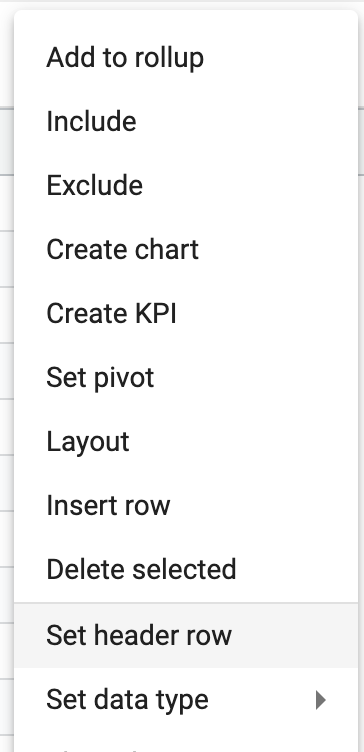

## Cleaning data

[**Video Tutorial**](https://youtu.be/THu5VhD-tj0?feature=shared)

Although StarLifter gives you several options for cleaning data, basic cleaning can be accomplished directly in a collection.

### Set a header row
1.  Right click on a row
2.  Select **Set header row**. Note that all data above this row will be deleted

</img>

### Edit field definitions
1.  Right click in the collection ➔ **Fields**
2.  Edit the field name, data type, and display format of the field
   
</img>

For more on data types, see [Data types and formats](https://docs.starlifter.io/#/how_to/data?id=data-types-and-formats)

### Edit the data dictionary
1.  Right click on the collection header ➔ **Show dictionary**
2.  Change the **Label** of a field to a more familiar term
3.  Update **Type** on multiple fields at once
4.  Select how the field is treated when aggregated: **sum**, **average**, or **none**
5.  Choose fields that should be hidden

</img>
