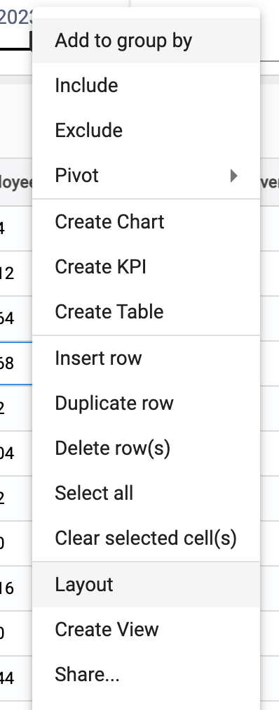
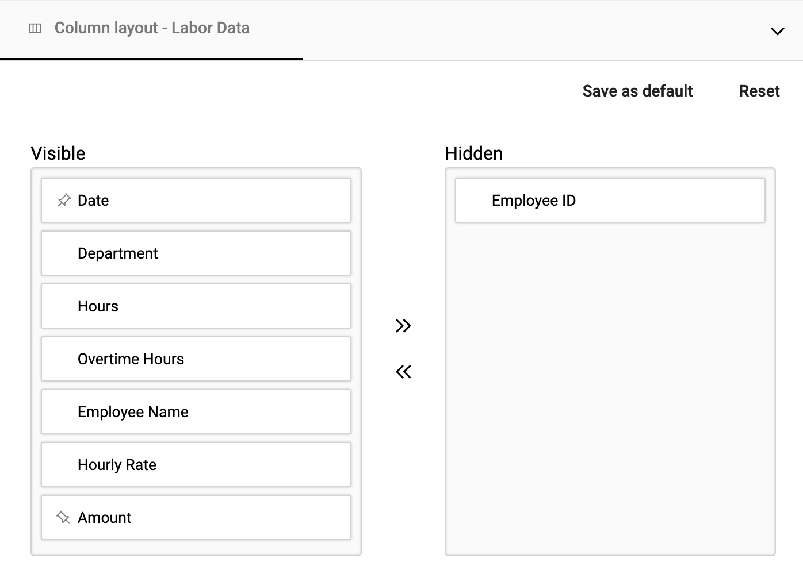
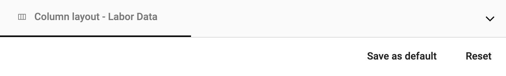
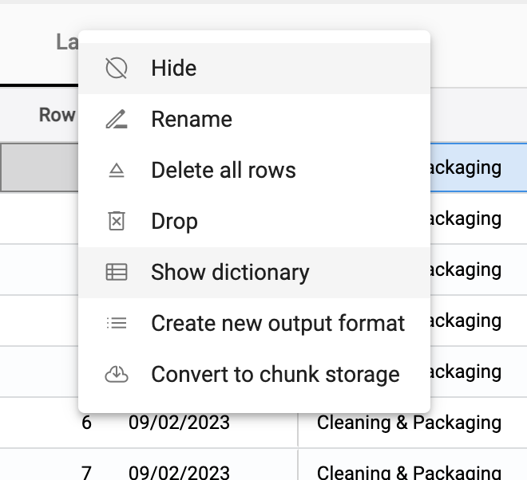
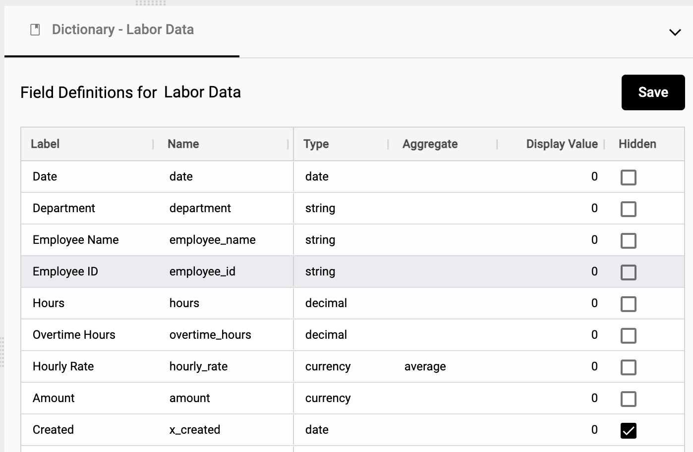

## Preparing a collection

### Make a collection easier to understand using the following steps.

## 1. Set the desired layout. 

Order the fields in a way that will make sense to your colleagues.  

#### Right click and select Layout.

</img>
   
#### Pin fields to the right, to the left, drag to reorder, or hide. 

</img>

Once completed, select **Save as default**.  This sets the layout for all users.  _Note:  They will be able to personalize their layout._

</img>   

## 2. Set dictionary. 

#### Right click on Collection and select Show dictionary.

The dictionary is only accessible by administrators of collections.  

   </img>
   
#### Relabel fields, set data type, hide/unhide, and change the format.

   </img>   
