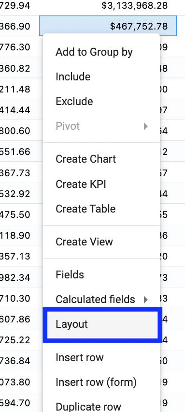
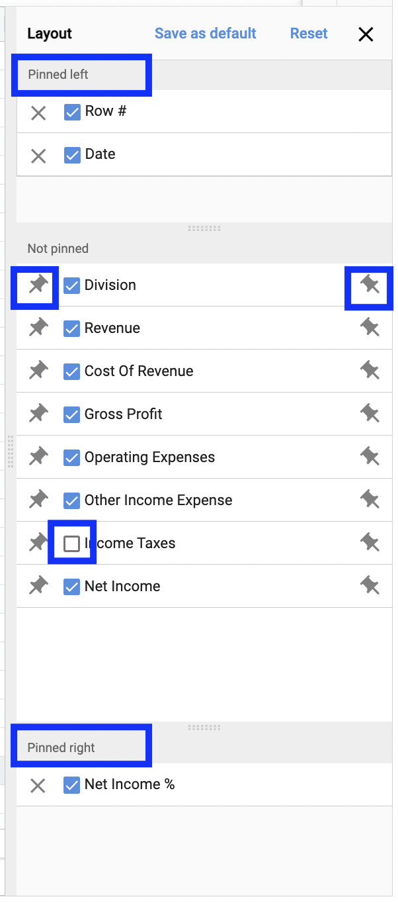
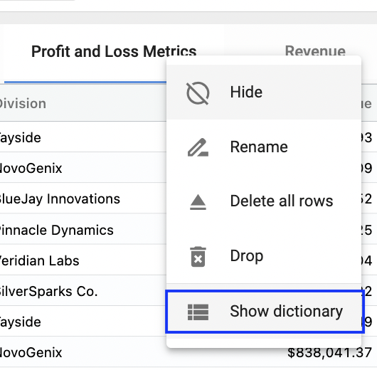
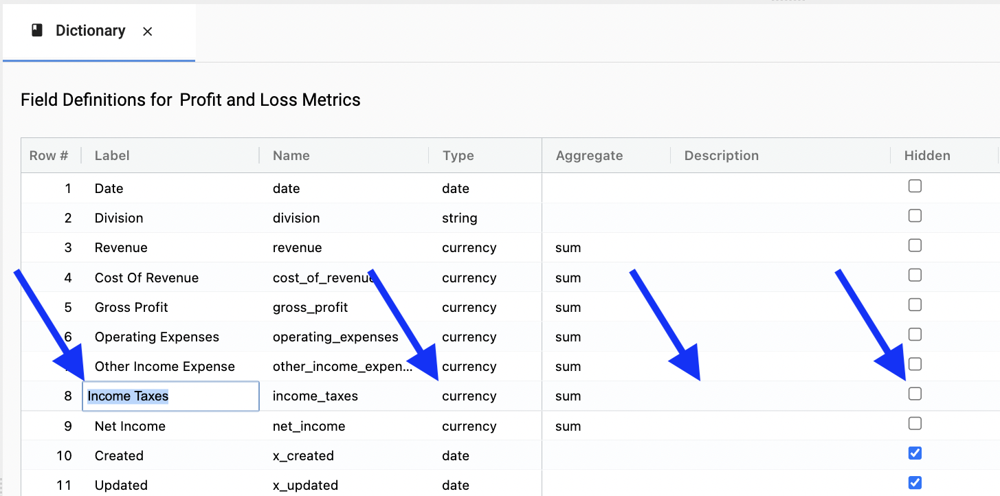

## Preparing a collection

### This page is for a user who is responsible for a collection.

## 1. Set the desired layout. 

Order the fields in a way that will make sense to your colleagues.  

#### Right click and select Layout.

   </img>
   
#### Pin fields to the right, to the left, drag to reorder, or hide. 

Once completed, select **Set default layout**.  This sets the layout for all users.  Note:  They will be able to personalize their layout.

   </img>   
   
## 2. Set dictionary. 

#### Right click on Collection and select Show dictionary.

The dictionary is only accessible by administrators of collections.  

   </img>
   
#### Relabel fields, set data type, hide/unhide, and write description.

   </img>   
