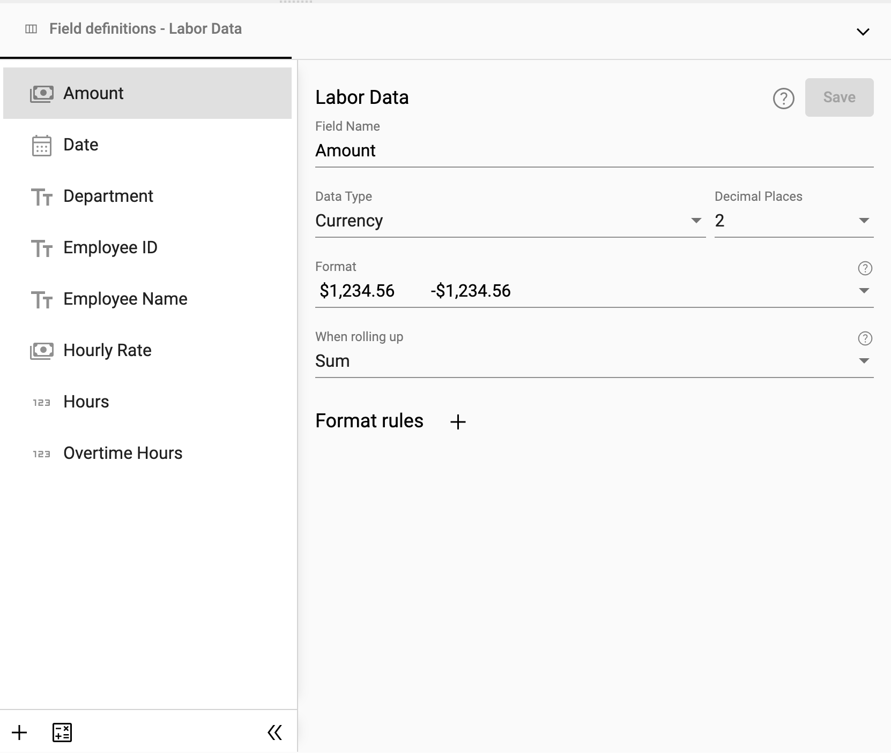

## Preparing a Collection

Although StarLifter gives you several options for setting up data, the basics can be accomplished directly in a collection.

### Set a header row

<!-- [**Video Tutorial**](https://youtu.be/THu5VhD-tj0?feature=shared) -->

1.  Right click on a row
2.  Select **Set header row**. Note that all data above this row will be deleted

</img>

### Set the desired layout. 

<!-- [**Video Tutorial**](https://youtu.be/x5n19V9foWA?feature=shared) -->

1. Right click and select Layout.

</img>
   
2. Pin fields to the right, to the left, drag to reorder, or hide. 

</img>

3. Once completed, select **Save as default**.  This sets the layout for all users.

</img>   

_Note:  Users will also be able to personalize their layout._

## Setting Up Fields

There are two ways to set up fields in StarLifter.

### Edit field definitions in the grid
1.  Right click in the collection ➔ **Fields**
2.  Edit the field name, data type, and display format of the field
   
</img>

### Edit field definitions in the dictionary
 
1.  Right click on the collection header ➔ **Show dictionary**

 </img>

2.  Change the **Label** of a field to a more familiar term
3.  Update **Type** on multiple fields at once
4.  Select how the field is treated when aggregated: **sum**, **average**, or **none**
5.  Choose fields that should be hidden

</img>

_Note: The dictionary is only accessible by administrators of collections._

For more on data types, see [Data types and formats](how_to/data?id=data-types-and-formats)
