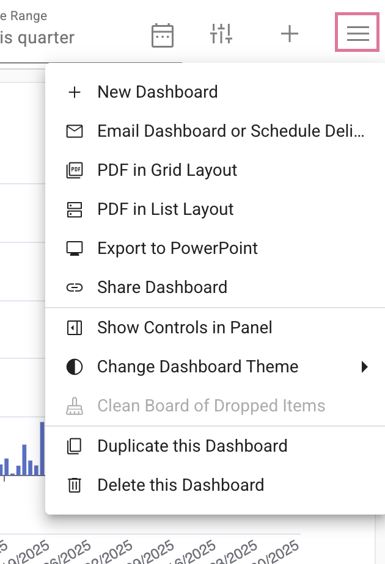
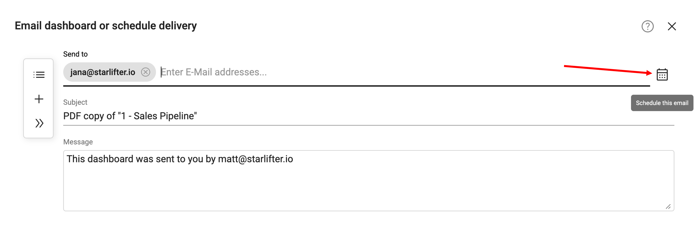
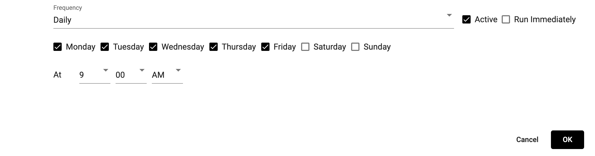

## Dashboards

<!-- [**Video Tutorial**](https://youtu.be/vYwm5m20FZg?feature=shared) -->

Dashboards allow you to visualize data through charts, tables, and KPIs.

### Access a dashboard

Access a dashboard using the navigational tools at the top of the screen

</img>

Saved dashboards are listed in the dropdown:

</img>

### Rename a dashboard
1.  Double click on the title
2.  Type in a new name

</img>

### Dashboard menu
The dashboard menu gives you the options below:

</img>

### Email a dashboard
To email a dashboard, select the email icon from the dashboard menu. Select the recipient, subject, and message. Click **Send Email** to send.

</img>

To set up a recurring email, select the calendar icon

</img>

Set your desired frequency (hourly, daily, monthly), date, and time. Check Active, and click **OK** to save.

</img>

### Change the theme of a dashboard
Select Default from the dashboard menu to change the dashboard theme

</img>