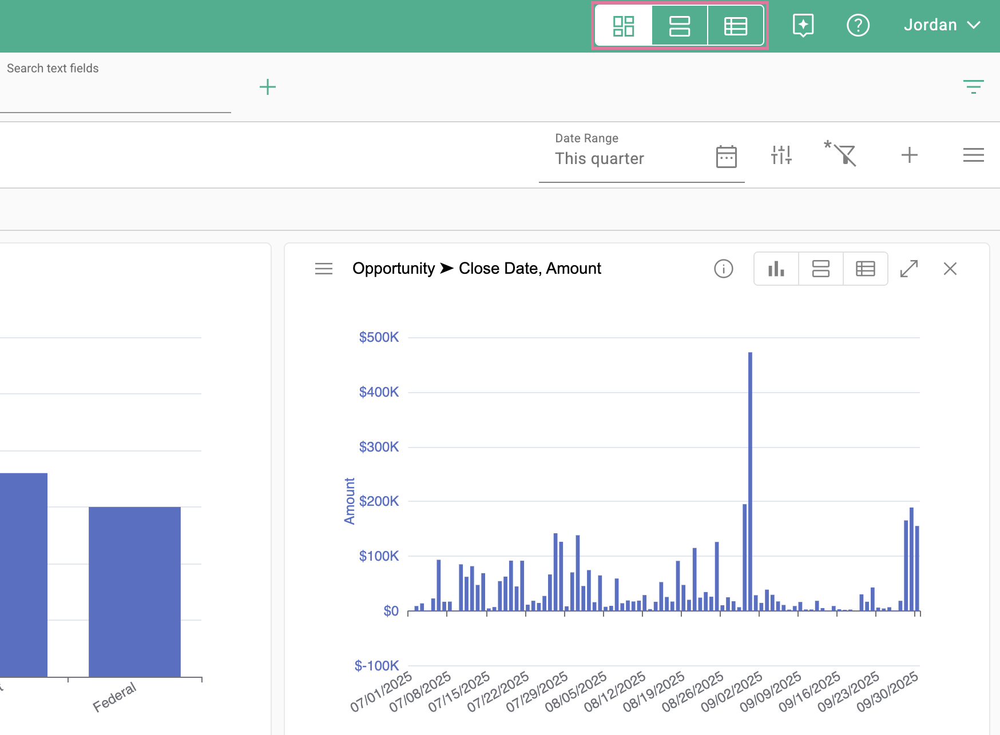
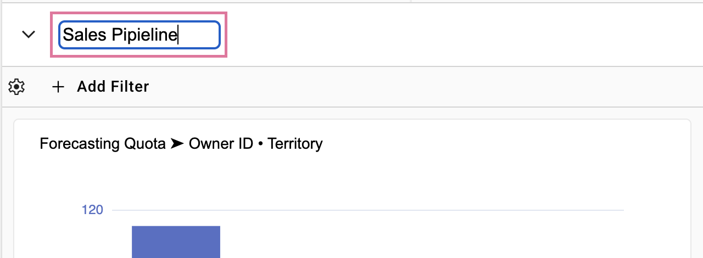
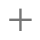
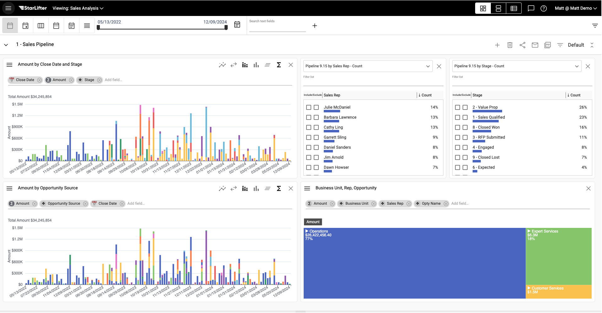
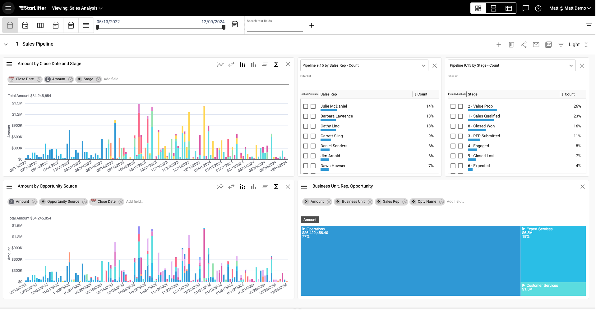
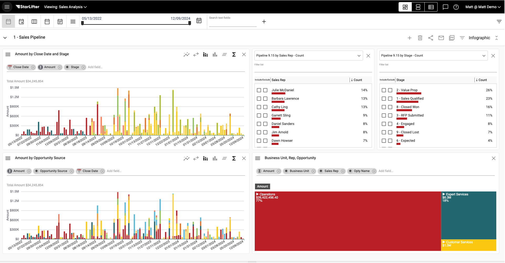

## Dashboards

Dashboards allow you to visualize your data through charts, tables, and KPIs

### Access a dashboard:

Access a dashboard using the navigational tools at the top of your screen

</img>

Saved dashboards are listed in the dropdown:

</img>

### To rename a dashboard:
1.  Double click on the title
2.  Type in a new name

</img>

### Dashboard menu:
The dashboard menu gives you the options below:

| Icon                                                                                         | Description                          |
|----------------------------------------------------------------------------------------------|--------------------------------------|
| </img>        | Create a new dashboard               | 
| </img>       | Delete this dashboard                |
| </img>      | Share this dashboard                 |
| </img>      | Email dashboard or schedule delivery | 
| </img>        | Create and download a PDF            |
|</img>| Add a Quick Filter                   |

### Share a dashboard
To grant access to another user, select the share icon from the dashboard menu. Sharing a dashboard also shares the collections of data that make up the dashboard.

</img>

### Email a dashboard
To email a dashboard, select the email icon from the dashboard menu. Select the recipient, subject, and message. Click **Send Email** to send.

</img>

To set up a recurring email, select the calendar icon

</img>

Set your desired frequency (hourly, daily, monthly), date, and time. Check Active, and click **OK** to save

</img>

### Change the theme of a dashboard
Select Default from the dashboard menu to change the dashboard theme

</img>

Default

</img>

Light

</img>

Infographic

</img>
