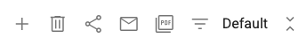

## Dashboards

All dashboards are listed in the dropdown:

</img>

### To save rename a dashboard:
1.  Double click on the title
2.  Type in a new name

</img>

### Dashboard menu:

</img>

The dashboard menu gives you the options below:

</img> Create a new dashboard

</img> Delete this dashboard

</img> Share this dashboard

</img> Email dashboard or schedule delivery

</img> Create & download a PDF

</img> Quick Filter

### Change the theme of a dashboard

From the dashboard menu, select themes from the dashboard theme dropdown:

</img>

### Sharing a dashboard
1. Select the share icon: 

</img>

### Emailing or scheduling the email of a dashbaord
1. Select the mail icon:

</img>

2. To schedule an email, select the calendar icon:

</img>
