## Dashboards

Dashboards allow you to visualize your data through charts, tables, and KPIs

### Access a dashboard:

Access a dashboard using the navigational tools at the top of your screen

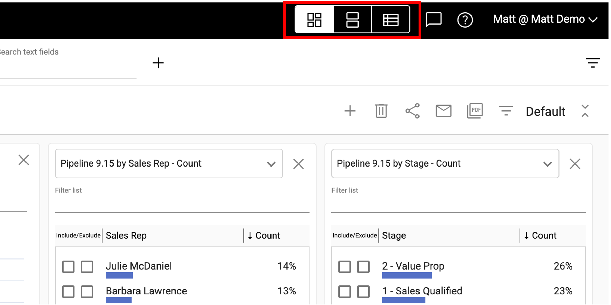</img>

Saved dashboards are listed in the dropdown:

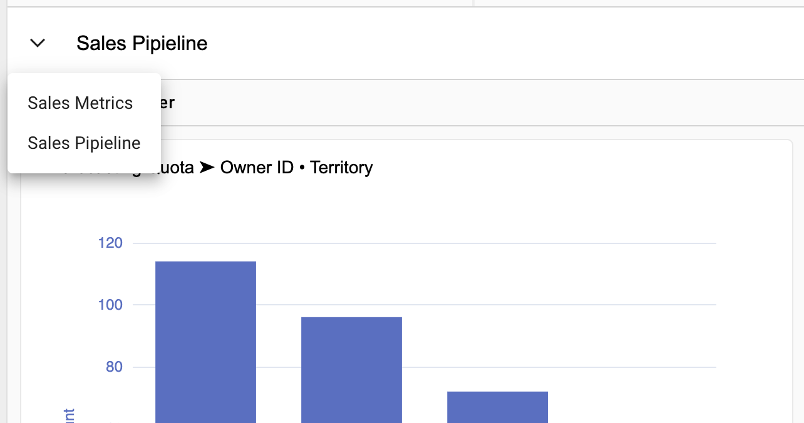</img>

### To rename a dashboard:
1.  Double click on the title
2.  Type in a new name

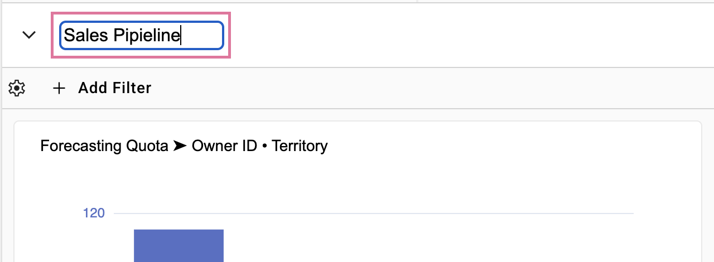</img>

### Dashboard menu:
The dashboard menu gives you the options below:

| Icon                                                                                         | Description                          |
|----------------------------------------------------------------------------------------------|--------------------------------------|
| 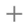</img>        | Create a new dashboard               | 
| </img>       | Delete this dashboard                |
| </img>      | Share this dashboard                 |
| </img>      | Email dashboard or schedule delivery | 
| </img>        | Create & download a PDF              |
|</img>| Quick Filter                         |

### Share a dashboard
To grant access to a user, select the share icon from the dashboard menu. Sharing a dashboard also shares the collections of data that make up the dashboard.

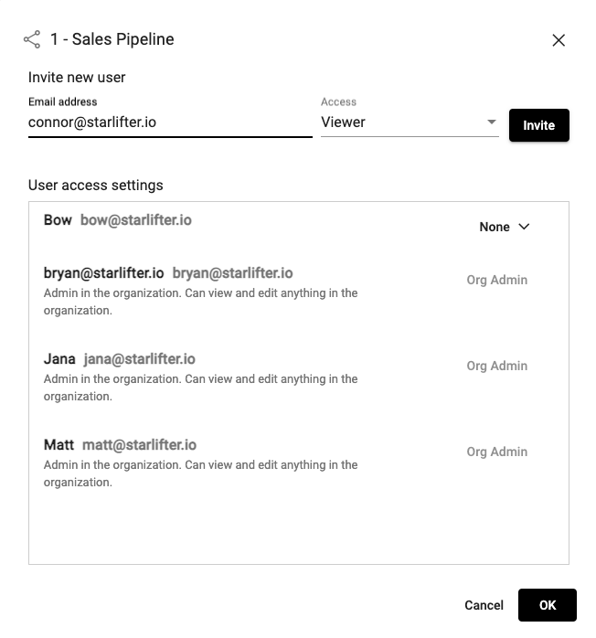</img>

### Email a dashboard
To email a dashbaord, select the email icon from the dashboard menu.

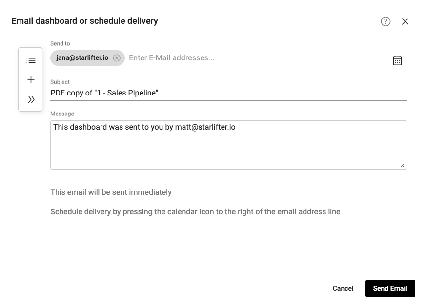</img>

Select the calendar icon to schedule the email

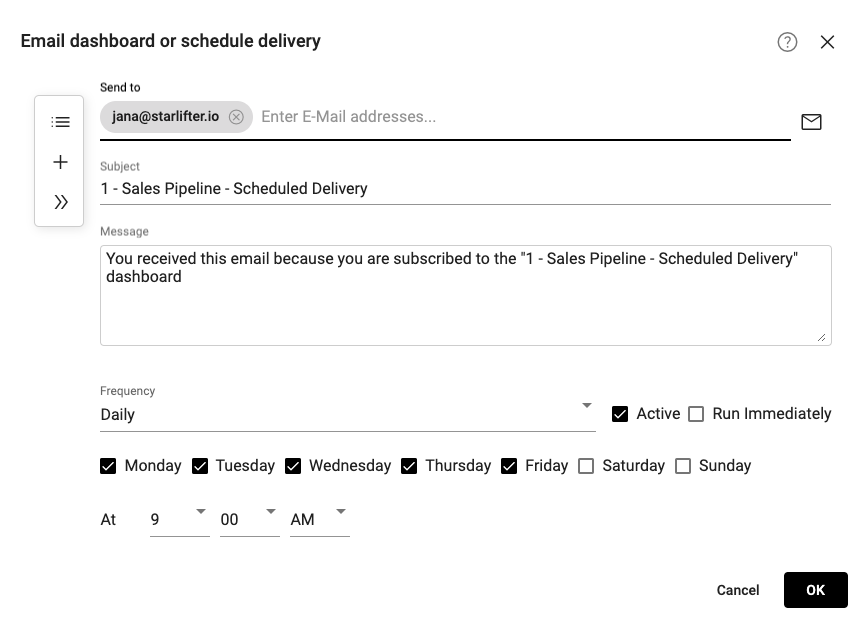</img>

### Change the theme of a dashboard
Select Default from the dashboard menu to change the dashboard theme

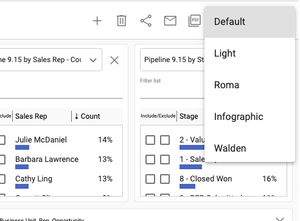</img>

Default

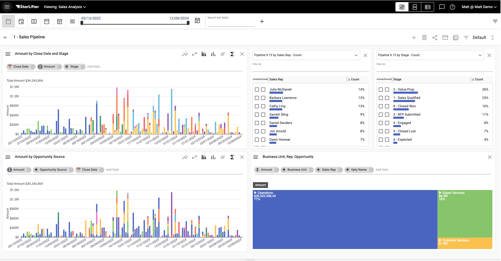</img>

Light

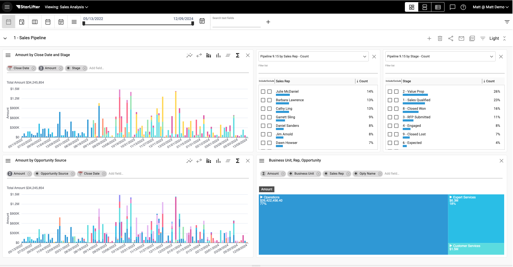</img>

Infographic

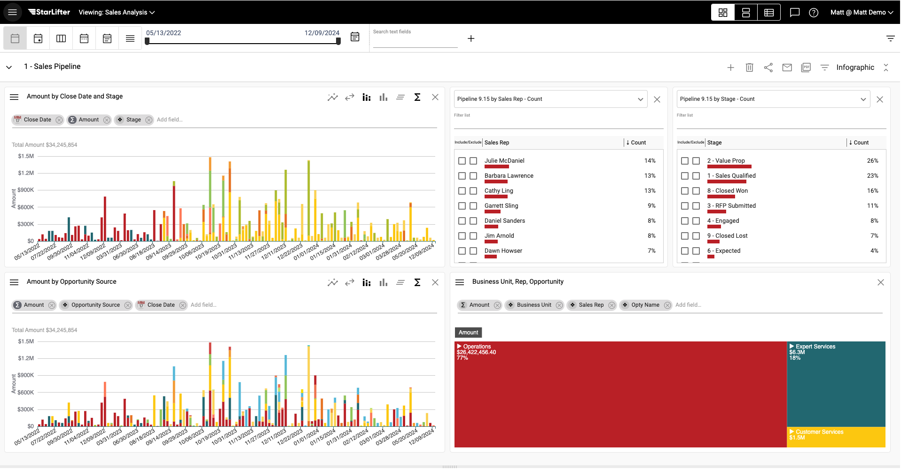</img>
