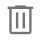
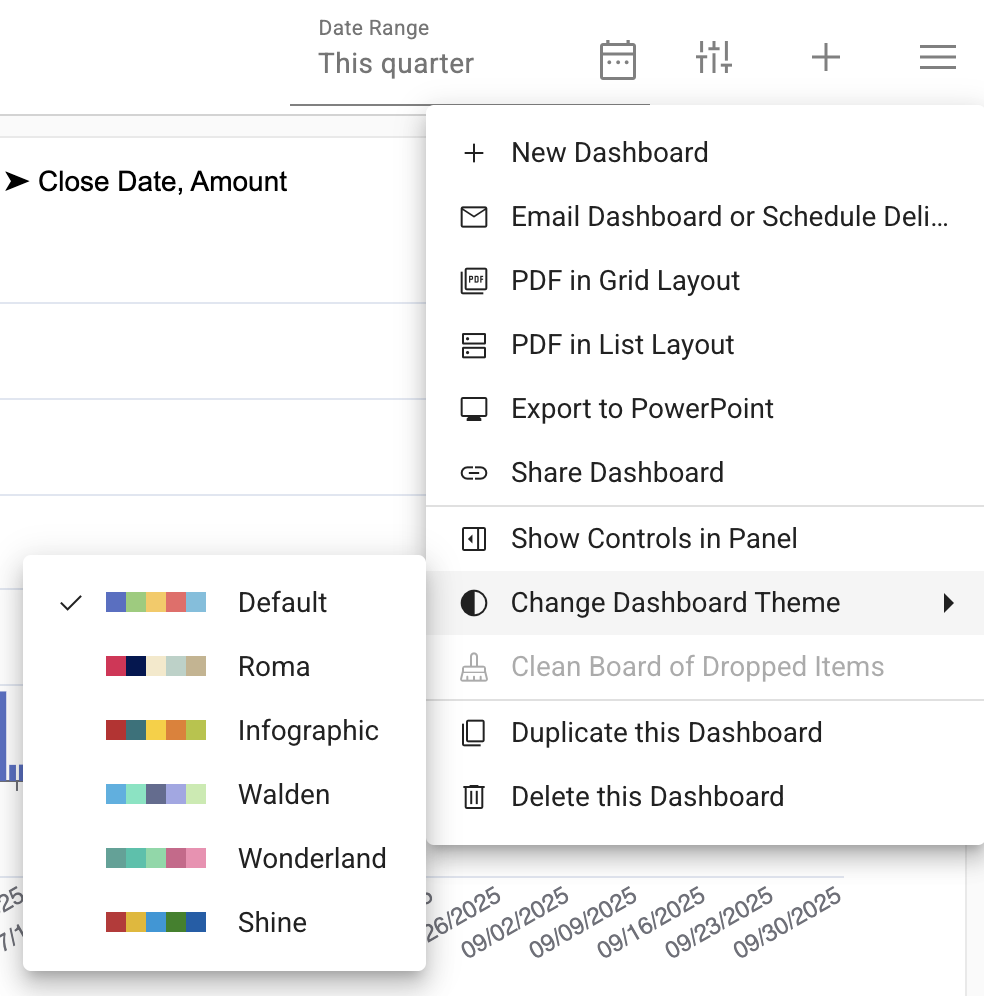

## Dashboards
All dashboards are listed in the dropdown:

</img>

### To rename a dashboard:
1.  Double click on the title
2.  Type in a new name

</img>

### Dashboard menu:
The dashboard menu gives you the options below:

| Icon                                                                                         | Description                          |
|----------------------------------------------------------------------------------------------|--------------------------------------|
| </img>        | Create a new dashboard               | 
| </img>       | Delete this dashboard                |
| </img>      | Share this dashboard                 |
| </img>      | Email dashboard or schedule delivery | 
| </img>        | Create & download a PDF              |
|</img>| Quick Filter                         |

### Change the theme of a dashboard
Select Default from the dashbaord menu to change the dashboard theme

</img>

### Sharing a dashboard
Select the email icon from the dashboard menu 

</img>

### Emailing a dashboard
Select the </img> icon to email a dashboard

</img>

Select the calendar icon to schedule the email

</img>
