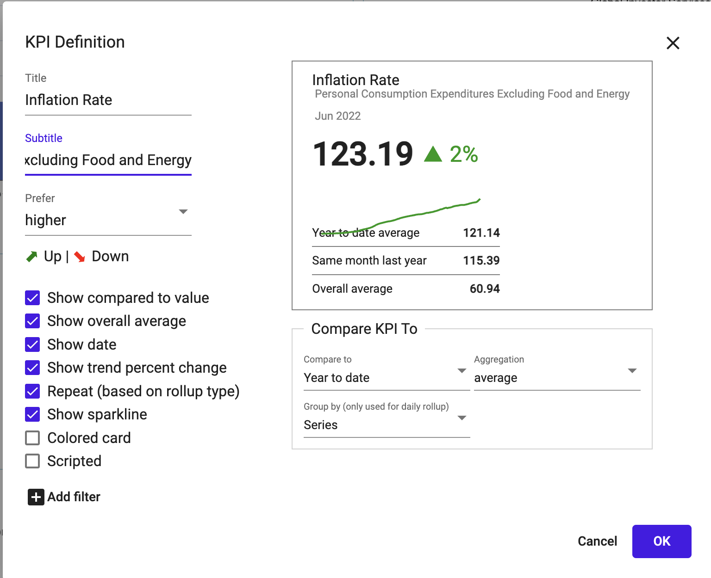
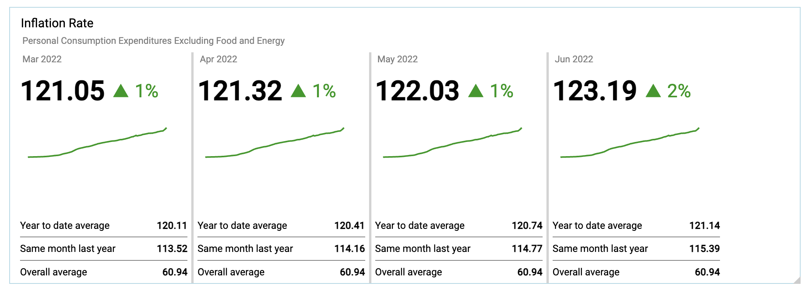
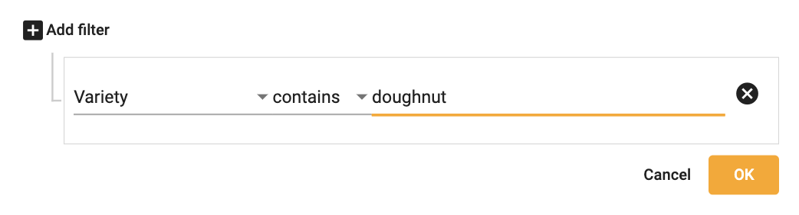

## Create KPIs

1.  Right click ➔ **Create KPI**

</img>

</img>

2.  To edit the KPI, click the pencil

</img>

3.  Make edits to title, arrow, color, sparkline, etc.

</img>

4. Add a repeated multi-pane KPI

</img>

5.  Add filter to KPI
  *Example:  Filtering the 'Total Bins' KPI on a specific variety*

</img>

5.  Select **OK**

</img>
