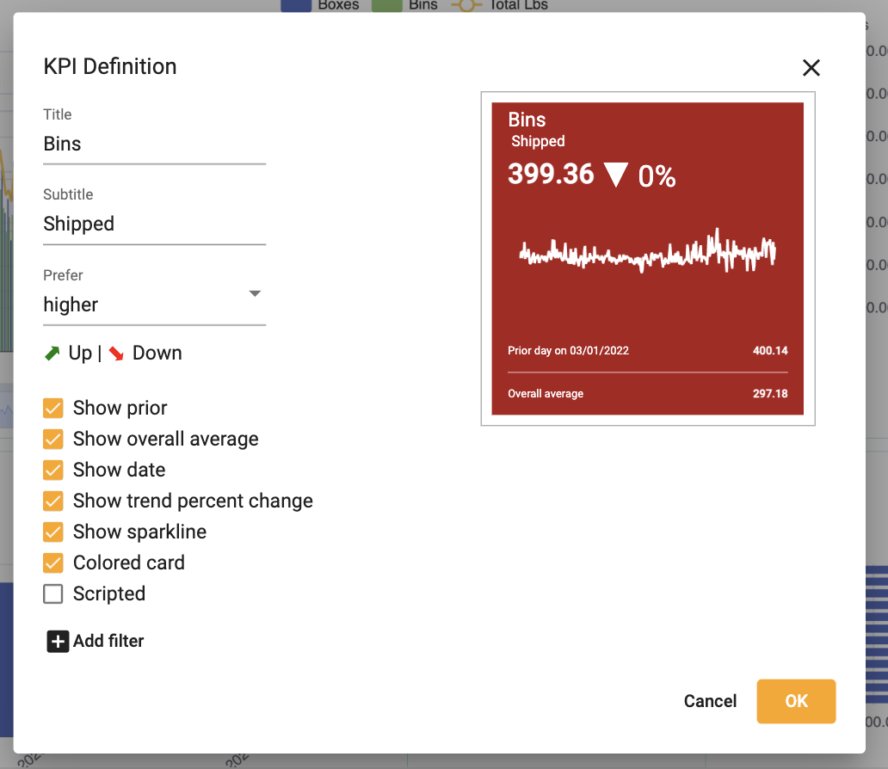

## Create KPIs

1.  Right click ➔ **Create KPI**

</img>

</img>

2.  To edit the KPI, click the pencil

</img>

3.  Make edits to title, arrow, color, sparkline, etc.

</img>

</img>

4.  Add filter to KPI

</img>

5.  Select OK

</img>
