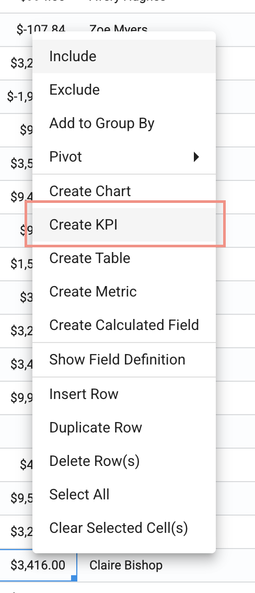
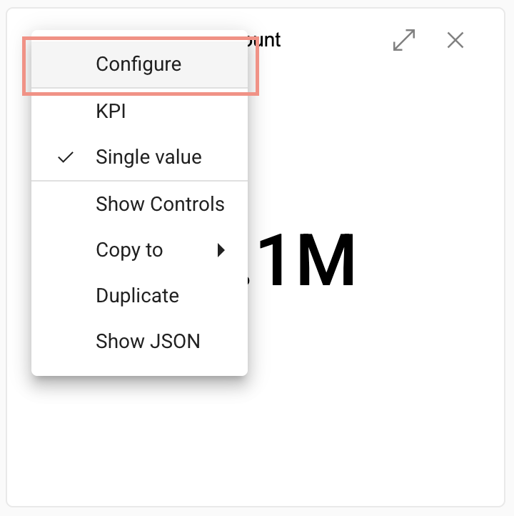

## KPIs

<!-- [**Video Tutorial**](https://youtu.be/Z-61QXzBcFI?feature=shared) -->

Key Performance Indicators (KPIs) give you visibility into key metrics that allow you to measure performance and make decisions.

### Create a KPI

1.  Right click on the field ➔ **Create KPI**

</img>

</img>

2.  To edit the single value KPI, click menu in the top left corner of the KPI and select **Configure**.

</img>

</img>

3. Change the type by clicking the menu in the top left corner and select **KPI** or **Single value**
-  single value is the default

</img>

4. KPI type configuration options:

</img>

5. Check **Repeat (based on rollup type)** to create a repeated multi-pane KPI

</img>

6.  Add filter to KPI
  *Example:  Filtering the 'Account Code Category' KPI on a specific category*

</img>

7.  Select **OK**

</img>
