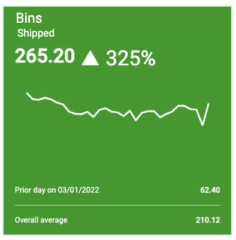

## KPIs

<!-- [**Video Tutorial**](https://youtu.be/Z-61QXzBcFI?feature=shared) -->

Key Performance Indicators (KPIs) give you visibility into key metrics that allow you to measure performance and make decisions.

### Create a KPI

1.  Right click on the field ➔ **Create KPI**

</img>

</img>

2.  To edit the KPI, click the pencil

</img>

3.  Make edits to title, arrow, color, sparkline, etc.

</img>

4. Check **Repeat (based on rollup type)** to create a repeated multi-pane KPI

</img>

5.  Add filter to KPI
  *Example:  Filtering the 'Account Code Category' KPI on a specific category*

</img>

5.  Select **OK**

</img>
