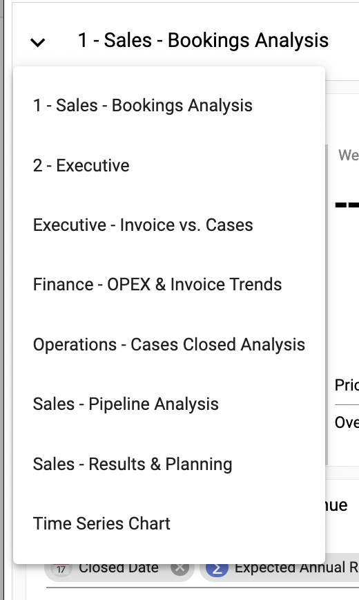
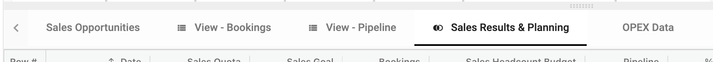
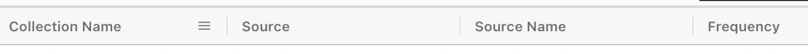

## Welcome to StarLifter

This article is for Organization Administrators who have been invited to a partially or fully implemented organization in StarLifter.

To get acquainted with the organization:
1.  Briefly review the dashboards to get a sense of the types of analysis completed to date.  To do this, select the downward arrow next to the dashboard name.

   </img>

2.  Briefly review the collections of data in the organization.  You can toggle through the collections on the ribbon below the dashboards.  

   </img>

There are different ways a collection is added.  It's not critical for you to review the types now; however, make it a point to come back and read through the following:

 * [Creating a new collection](https://docs.starlifter.io/#/how_to/new)
 * [Uploading a collection from a spreadsheet](https://docs.starlifter.io/#/getting_started/quick-start?id=upload-data)
 * [Uploading new data to an existing collection](https://docs.starlifter.io/#/how_to/tag)
 * [Creating a view](https://docs.starlifter.io/#/how_to/view)
 * [Creating a join](https://docs.starlifter.io/#/how_to/join)

3.  Understanding your role in maintaining the data is one of the most important factors of your onboarding.  Look for a collection called **Data Sources**.  This collection provides a list of each source collection, where it comes from and how it is maintained.  Based on your role in data maintenance, review the help desk references above.  

   </img>
   

   </img>

4.  Now that you understand the type of analysis your organization is doing, where the data is coming from and your role in maintaining it, take a moment to explore StarLifter.  Here are some ideas to get you started:

    * Try building out your own dashboard.
      * [Add a dashboard](https://docs.starlifter.io/#/getting_started/dashboards)
      * [Add charts](https://docs.starlifter.io/#/getting_started/charts?id=charts)
      * [Add KPIs](https://docs.starlifter.io/#/getting_started/kpis)
    * Try analyzing data in a collection.
      * [Roll up data and filter](https://docs.starlifter.io/#/how_to/filter)
      * [Save a new filter](https://docs.starlifter.io/#/how_to/filter?id=how-to-rollup-and-filter)
      * [Create a pivot on the data](https://docs.starlifter.io/#/how_to/pivot)
    * Try creating a new field
      * [Create a calculation](https://docs.starlifter.io/#/how_to/calculate)
      * [Create a calculation using functions (simliar to spreadsheets)](https://docs.starlifter.io/#/how_to/functions)
      
 5.  For additional help and support, you may:
 
 * [Reference the Help Desk](https://docs.starlifter.io/)
 * [Join our community](https://community.starlifter.io/)
 * Contact your StarLifter account manager
   
