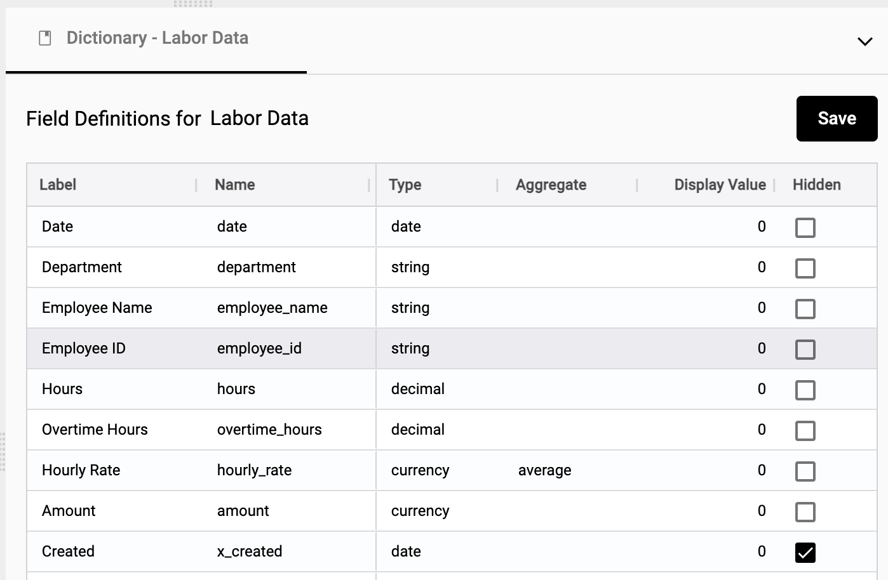

## Getting Started

### Upload data
1.  Select **Upload XLS, CSV...**

</img>

2.  Drag or select a file to upload

</img>

3.  The workbook file name is saved as the title of the domain
4.  Choose to add or ignore each collection (worksheet). Each line will create it's own collection within Starlifter.

    **Note**: The name of the collection comes from the name of the worksheet in the original file. You can change the name of the collection by editing the **Label** field 

</img>

5.  Select **GO**

### Set a header row
1.  Right click on a row
2.  Select **Set header row**
3.  Note:  All data above this row will be deleted

</img>

### Edit field definitions
1.  Right click in the collection ➔ **Fields**
2.  Edit the field name, data type, and display format of the field
   
</img>

For more on data types, see [Data types and formats](https://docs.starlifter.io/#/how_to/data?id=data-types-and-formats)

### Edit the data dictionary
1.  Right click on the collection header ➔ **Show dictionary**
2.  Change the **Label** of a field to a more familiar term
3.  Update **Type** on multiple fields at once
4.  Select how the field is treated when aggregated: **sum**, **average**, or **none**
5.  Choose fields that should be hidden

</img>

