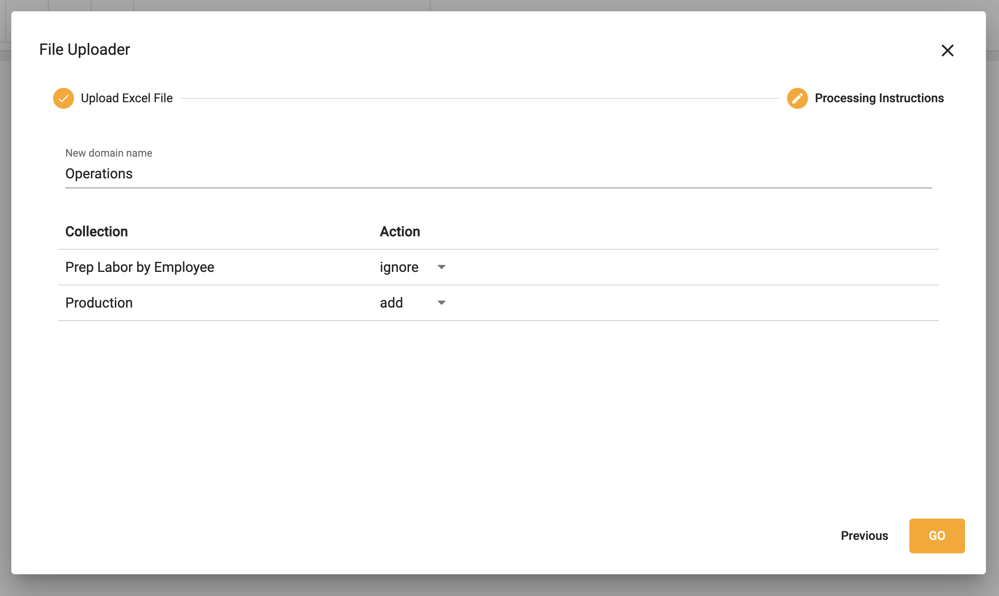

## Quick Start
### Create an organization
1.  Select **Create an Organization**
2.  Fill in details

</img>

3.  Click **Create organization**

### Upload data
1.  Select **Upload XLS, CSV...**

</img>

2.  Drag or select a file to upload

3.  The workbook is saved as a data domain
4.  Choose to add or ignore each collection the domain

5.  Select **GO**

### Set a header row
1.  Right click on a row
2.  Select **Set header row**
3.  Note:  All data above this row will be deleted

</img>

### Change data types on a field
1.  Right click ➔ **Set data type**
2.  Choose from whole number, decimal, percent, general, currency, characters, date or boolean

</img>

### Edit the data dictionary
1.  Rigth click ➔ **Show data dictionary**
2.  Change the **Label** of a field to a more familiar term
3.  Update **Type** on multiple fields at once
4.  Select how the field is treated when aggregated: **sum**, **average**, or **none**
5.  Choose fields that should be hidden
6.  Write a description of the field 

