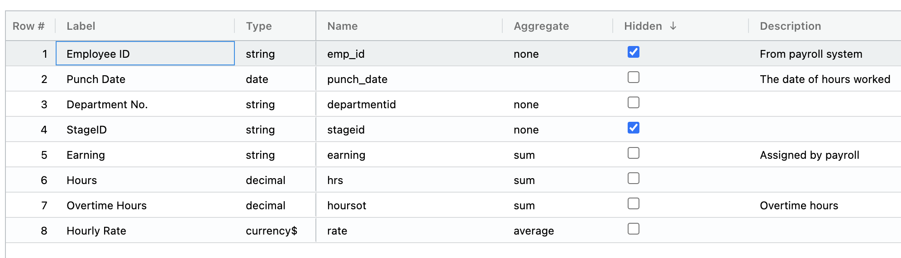

## Quick Start

**To create an organization:**
1.  Select **Create an Organization**

2.  Type in the organization name
3.  Select the first month of the fiscal year
4.  Select the first day of the work week
5.  Select a theme color

6.  Select **Create organization**

**To upload data:**
1.  Select **Upload XLS, CSV...**

2.  Drag or select a file to upload

3.  The workbook is saved as a data domain
4.  Choose to add or ignore each collection the domain

5.  Select **GO**

**To set a header row:**
1.  Right click on a row
2.  Select **Set header row**
3.  Note:  All data above this row will be deleted.

**To change data types on a field:**
1.  Right click ➔ **Set data type**
2.  Choose from whole number, decimal, percent, general, currency, characters, date or boolean

**To edit the data dictionary:**
1.  Rigth click ➔ **Show data dictionary**
2.  Change the **Label** of a field to a more familiar term
3.  Update **Type** on multiple fields at once
4.  Select how the field is treated when aggregated: **sum**, **average**, or **none**
5.  Choose fields that should be hidden
6.  Write a description of the field 

