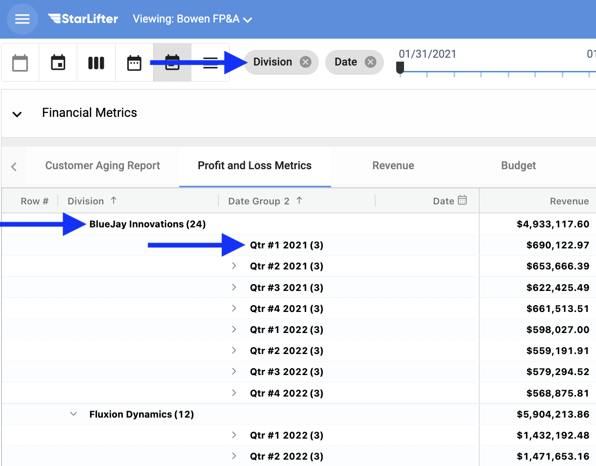
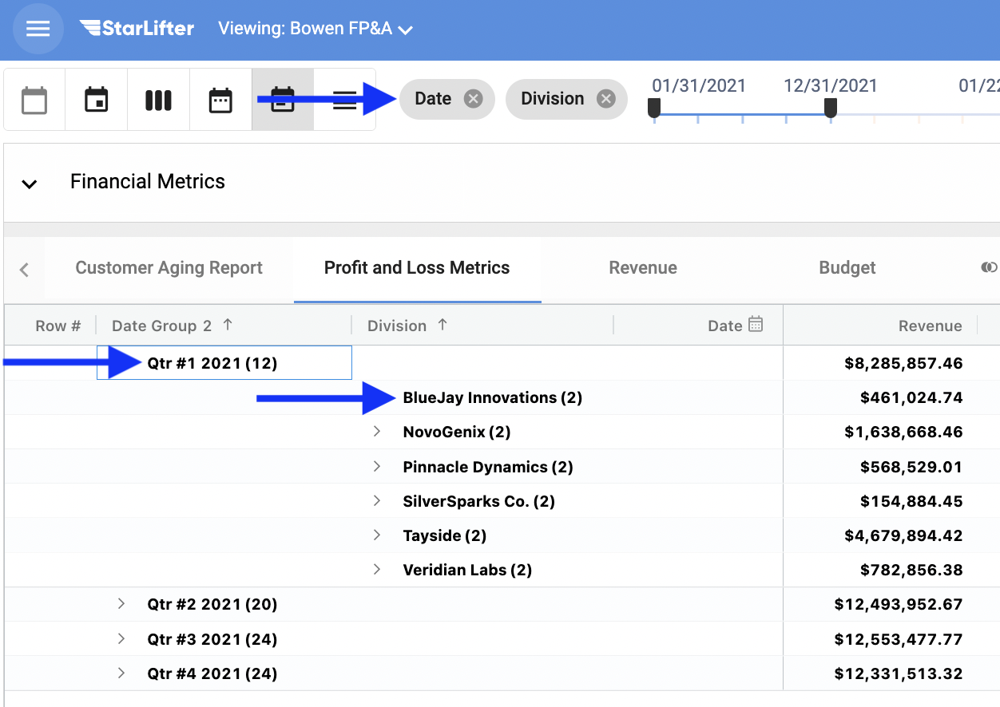
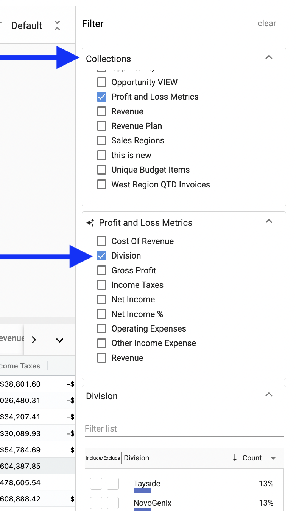
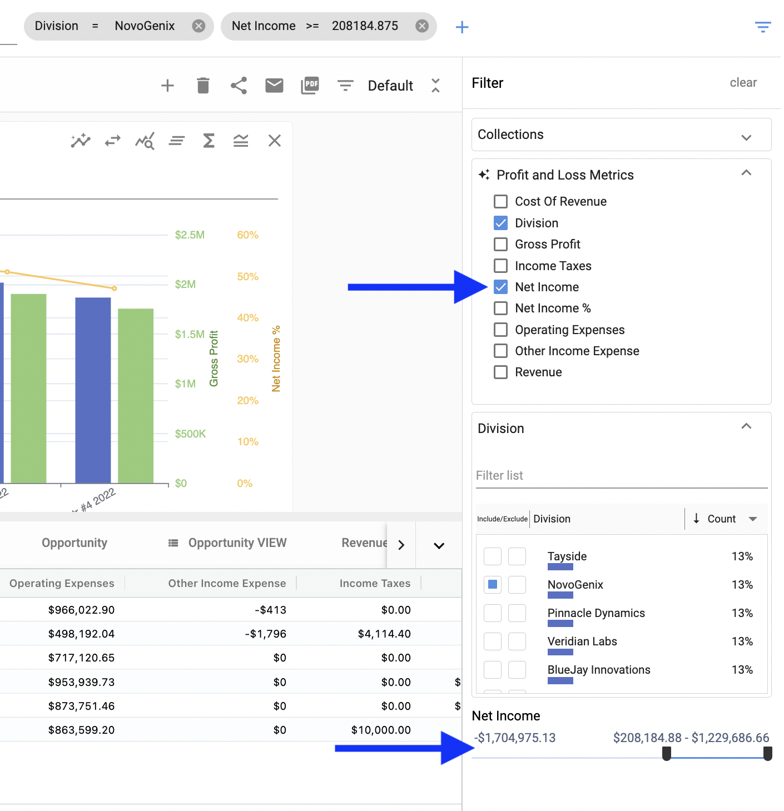
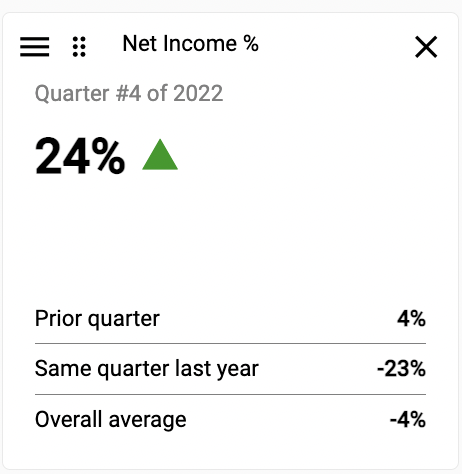

## Top 10 Actions to Know 

**1.  Roll up by date.**

**2.  Group by category.**

**3.  Roll up and group by.**

**4.  Filter by date.**

**5.  Filter.**

**6.  Create and edit a chart.**

**7.  Edit and edit a chart.** 

**8.  Create a KPI.**

**9.  Create a calculated field.**

**10. Share.**

**Bonus - 1.  Navigate.**

**Bonus - 2.  Open two collections.**

**Bonus - 3.  Use shortcuts.**

**1.  Roll up by date.**  To do this,  

   </img>
   </img>

**2.  Group by category.**  To do this,  

   </img>
   </img>

**3.  Roll up and group by.**  To do this,  
   
   </img>
   </img>
   </img>

**4.  Filter by date.**  To do this,  

   </img>

**5.  Filter - Three ways.**  To do this,  

   </img>
   </img>
   </img>
   </img>
   </img>
   </img>
   </img>
   </img>
   </img>
   
**6.  Create and edit a chart.**  To do this,  

   </img>
   </img>
   </img>
   
**8.  Create a KPI.**  To do this,  

   </img>
   </img>

**9.  Create a calculated field.**  To do this,  

</img>

**10. Share.**  To do this,  

</img>

**Bonus - 1.  Navigate**  To do this,  
   
   </img>
   </img>
   </img>
   </img>

**Bonus - 2.  Open two collections.**  To do this,  

 </img>

**Bonus - 3.  Use shortcuts.**  To do this,  

 </img>

 

### **Finally, for additional help and support, you may:**
 [**Reference the Help Desk**](https://docs.starlifter.io/)
 
 [**Join our community**](https://community.starlifter.io/)
 
 [**Contact your StarLifter account manager**](mailto:info@starlifter.io)
   
