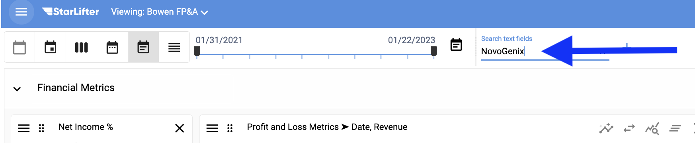
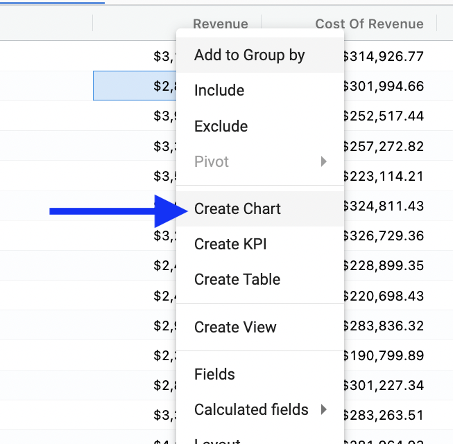
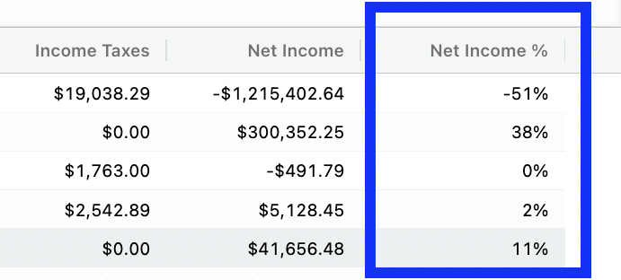
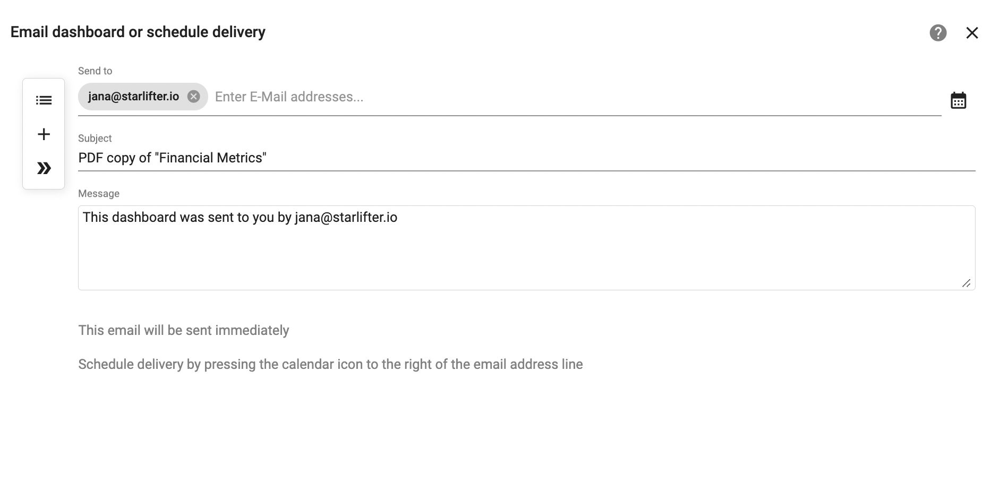

## New User - Top 10

### Fast track your use of StarLifter by learning these features:  

   1.  Roll up by date
   2.  Group by category
   3.  Roll up by date and group by category
   4.  Filter by date
   5.  Filter
   6.  Create and edit a chart
   7.  Create a KPI
   8.  Create a calculated field
   9. Share
   10. Subscribe

### Make your life easier by learning these pro-tips:

   1.  Navigate 
   2.  Open two collections
   3.  Use shortcuts

## **1.  Roll up by date**  

Select from the icons to roll up by day, week, month, quarter or year.

#### No roll up

   </img>
   
#### By quarter
   
   </img>
   
Back to top

## **2.  Group by category**  

Right click and select **Add to Group by**.

   </img>
   
#### Grouped by Division   
   
   </img>
   
Back to top   

## **3.  Roll up and group by**

To combine category groups and date roll ups, right click and select **Add to Group by** on the date field.
   
   </img>

#### Grouped by Division and then by quarter

   </img>

#### Drag the pills to reorder groupings  

   </img>

Back to top

## **4.  Filter by date**    

Move the date slider right to left or select the calendar icon to choose predefined and custom time periods.

   </img>

Back to top

## **5.  Filter - Three ways**    

#### 1.  Use the search field

   </img>
   
#### 2.  Add a Quick Filter
   
   </img>
   
Define your filter by selecting the Collection and Field.  
   
   </img>
   
The Quick Filter is added to the dashboard for ad hoc analysis.
   
   </img>
   
#### 3.  Pull the filter panel out using a keyboard shortcut

CONTROL + V  
   
   </img>
   
Filters build based off of the Collection and Fields selected. 

   </img>
   
Select filter icon to create a saved filter.  

   </img>

Name filter.

   </img>
   
Back to top

## **6.  Create and edit a chart**  

Right click **Create Chart**.

   </img>

Add additional fields.

   </img>
   
Futher customize chart.

   </img>

Move fields to secondary Y axis, line, etc.

   </img>

Back to top

## **7.  Create a KPI** 

Right click **Create KPI**.

   </img>
   
Customize KPI using settings. You may change titles as well as add fitlers, comparisons, colors, arrows, etc.

   </img>
   
Back to top   

## **8.  Create a calculated field** 

Right click **Create Calculated Field** 

   </img>

Then, select the fields, operators, data types, etc. you wish to include.

   </img>
   
Now, the new field is persisted in the Collection.

   </img>

Back to top

## **9. Share** 

Share a dashboard or collection by selecting the share icon.

   </img>

Then, add or select your desired user.

   </img> 
   
 Back to top
 
 ## **10. Subscribe** 

Subscribe to a dashboard for yourself or someone else.  Select the calendar icon.

   </img>

Choose desired frequency. 

   </img> 
   
 Back to top

## Bonus 1: Navigate     

Toggle back and forth between views using these icons.

   </img>
   
Back to top

#### Data only

   </img>

#### Data and dashboard

   </img>

#### Dashboard only 

   </img>

Back to top

## Bonus 2: Open two collections. 

Hold SHIFT and select another collection to open two collections at the same time.

 </img>

Back to top

## Bonus 3:  Use shortcuts

Press CONTROL to open the accelator key menu and select your desired key.

* A:  Admin
* B:  Dashboard & Grid
* C:  Chat
* D:  Dashboard
* F:  Find
* G:  Grid 
* I:  Insert Row
* V:  Filter Panel
* ?:  Documentation

## Additional help and support:
 
 [**Reference the Help Desk**](https://docs.starlifter.io/)
 
 [**Join our community**](https://community.starlifter.io/)
 
 [**Contact your StarLifter customer success manager**](mailto:info@starlifter.io)
   
