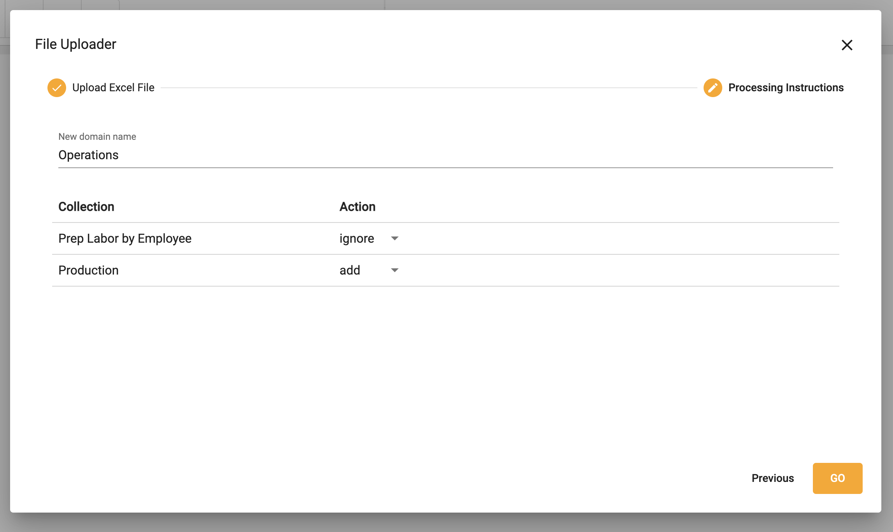

## Upload data

[**Video Tutorial**](https://youtu.be/_QFPM6rfksM?feature=shared)

1.  Select **Upload XLS, CSV...**

</img>

2.  Drag or select a file to upload

</img>

3.  The workbook is saved as a data domain
4.  Choose to add or ignore each collection to the domain

</img>

5.  Select **GO**
