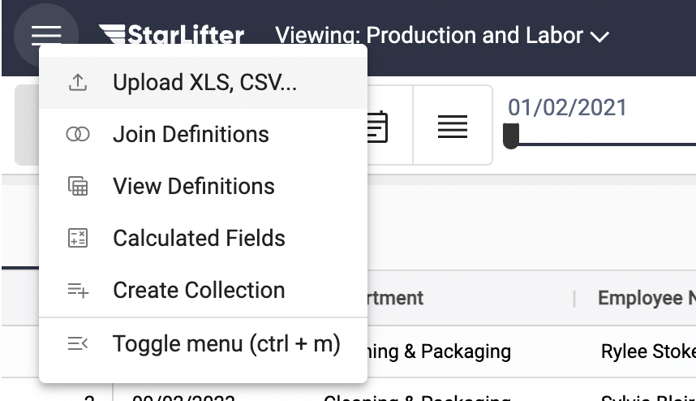
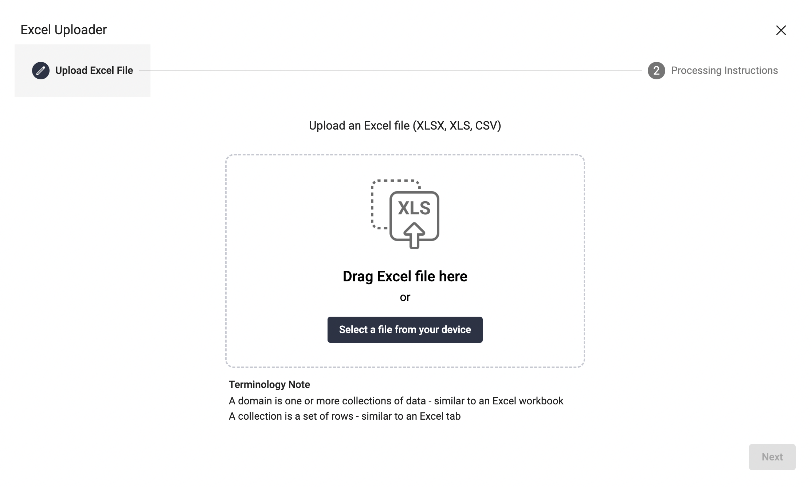
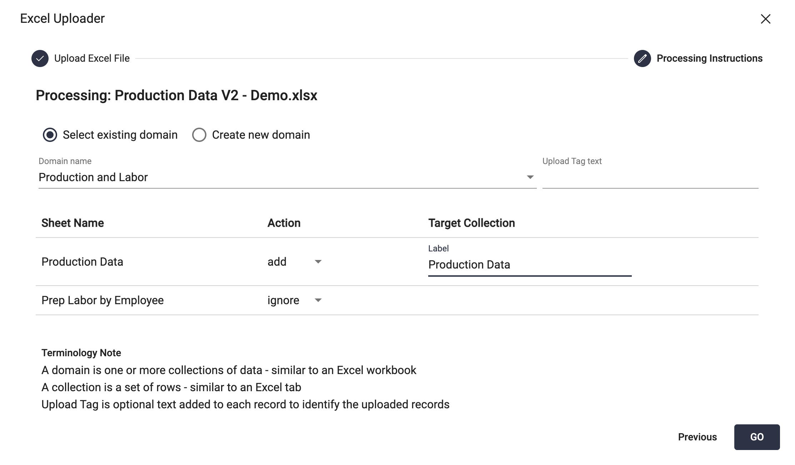
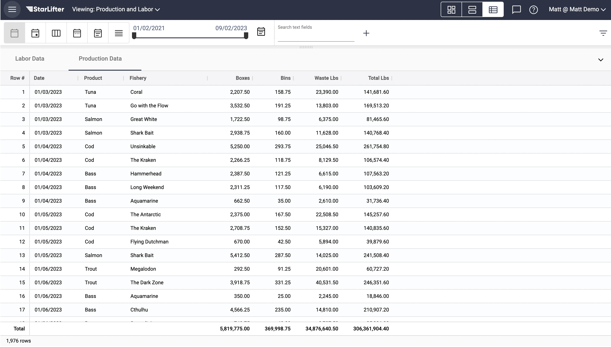

## Manually upload data

[**Video Tutorial**](https://youtu.be/_QFPM6rfksM?feature=shared)

1. From the menu at the upper left of the screen, select **Upload XLS, CSV...**

</img>

2. Click **Select file from your device**, and navigate to the file you wish to upload. Or, simply drag the file onto the screen.

</img>

3.  Select the domain and name the collection. Choose from the following actions to upload the data:
  * **Add:** Add the data as a new collection 
  * **Replace:** Replace an existing collection with data from the file
  * **Append:** Append data to an existing collection
  * **Ignore:** Do not upload the data

</img>

4.  Select **GO**. Data is now uploaded to a StarLifter collection.

</img>

