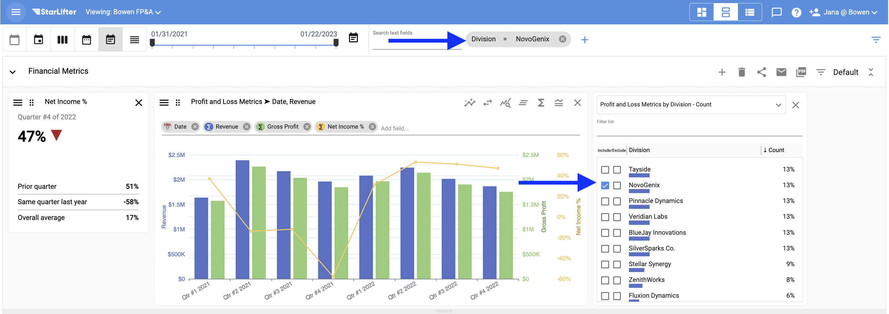
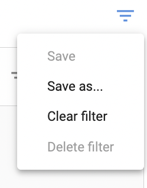
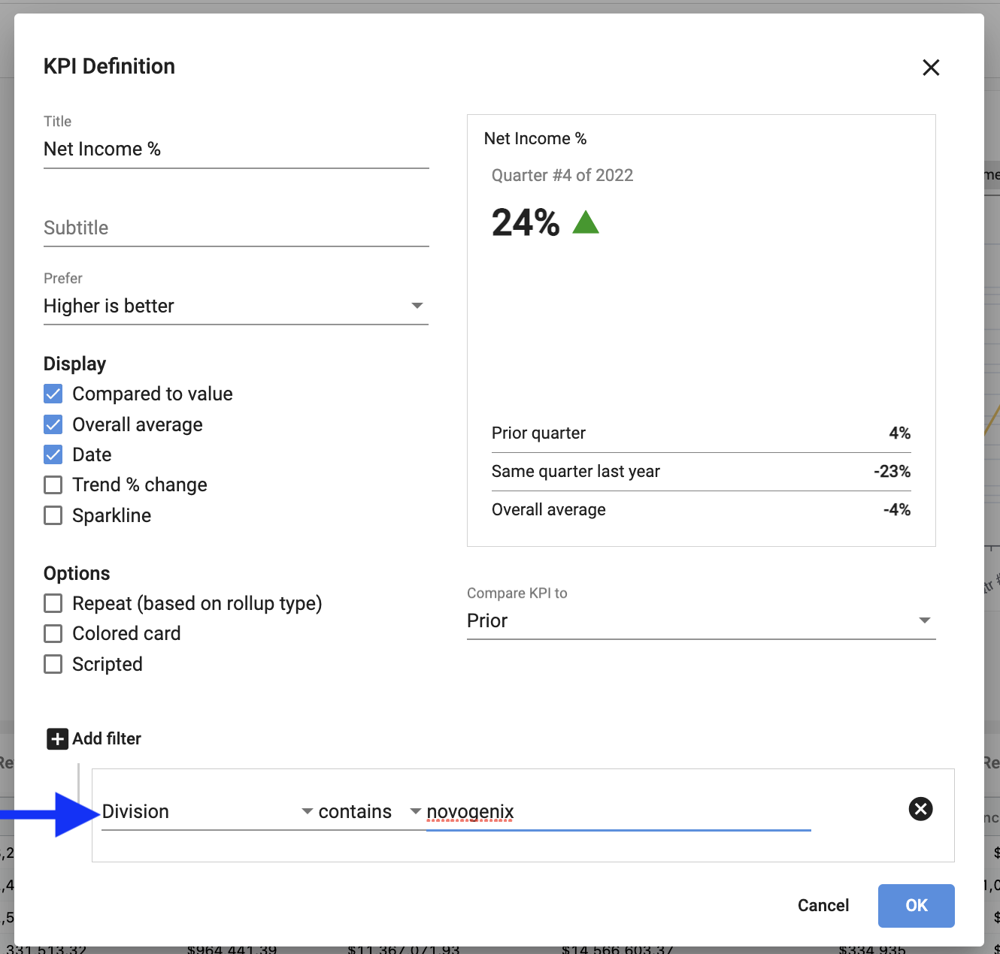
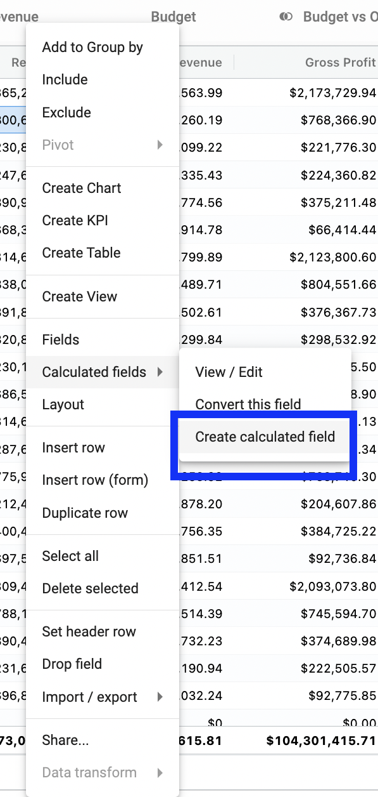
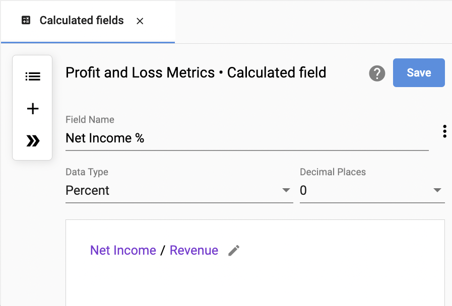

## Preparing for the Company Meeting with StarLifter (P&L)

The CFO at Bowen is about to lead the annual meeting to discuss company performance. She is going to use StarLifter to: 

1. [Examine the data](#examine)
2. [Understand divisional performance](#filter)
3. [Visualize the data with charts](#visualize)
4. [Calculate a key metric](#calculate)
5. [Send out dashboards](#share)

### _**She’s first going to examine the data with all the built in StarLifter tools:**_ 
* [Roll up by date](#by-date)
* [Group by category](#category)
* [Roll up by date and group by category](#by-category)
* [Filter by date](#filter-by-date)
* [Filter](#filter-methods)

### **Roll up by date** 

Select from the icons to roll up by day, week, month, quarter or year.

#### No roll up

   </img>
   
#### By quarter
   
   </img>
   
[Back to top](#top)

### **Group by category** 

#### Right click and select **Add to Group by**.

   </img>
   
#### Grouped by Division   
   
   </img>
   
[Back to top](#top)   

### **Roll up and group by** 

To combine category groups and date roll ups, right click and select **Add to Group by** on the date field.
   
   </img>

#### Grouped by Division and then by quarter

   </img>

#### Drag the pills to reorder groupings  

   </img>

### **Filter by date** 

Move the date slider right to left or select the calendar icon to choose predefined and custom time periods.

   </img>

## _**When she presents, she wants to quickly understand different divisional performance in addition to aggregate.**_ 

### **Filter - Three ways** 

#### 1.  Use the search field

   </img>
   
#### 2.  Add a Quick Filter
   
   </img>
   
#### Define your filter by selecting the Collection and Field.  
   
   </img>
   
#### The Quick Filter is added to the dashboard for ad hoc analysis.
   
   </img>
   
#### 3.  Pull the filter panel out using a keyboard shortcut

#### CONTROL + V  
   
   </img>
   
#### Filters build based off of the Collection and Fields selected. 

   </img>
   
#### Select filter icon to create a saved filter.  

   </img>

#### Name filter.

   </img>

## _**The Bowen CFO now knows what she wants to tell her team. Next up is visualizing the data.**_ 

* [Create and edit a chart](#edit-chart)
* [Create a KPI](#kpi)

### **Create and edit a chart** 

#### Right click Create Chart.

   </img>

#### Add additional fields.

   </img>
   
#### Further customize chart.

   </img>

#### Move fields to secondary Y axis, line, etc.

   </img>

### **Create a KPI** 

#### Right click Create KPI.

   </img>
   
Customize KPI using settings. You may change titles as well as add fitlers, comparisons, colors, arrows, etc.

   </img>

## _**A key metric for her company is Net Income %, which is not included in the raw data. She’s going to create a calculated field and add it to her dashboard as a KPI.**_ 

### **Create a calculated field** 

#### Right click Create Calculated Field. 

   </img>

#### Then, select the fields, operators, data types, etc. you wish to include.

   </img>
   
#### Now, the new field is persisted in the Collection.

   </img>

[Back to top](#top)

## _**To ensure everyone is prepared, she is going to send out this dashboard prior to the meeting and send it to herself on a schedule for future reference.**_ 

* [Share](#share)
* [Subscribe](#subscribe)

### **Share** 

#### Share a dashboard or collection by selecting the share icon.

   </img>

#### Then, add or select your desired user.

   </img> 
   
 [Back to top](#top)
 
 ### **Subscribe** 

#### Subscribe to a dashboard for yourself or someone else.  Select the calendar icon.

   </img>

#### Choose desired frequency. 

   </img> 
   
## _**The Bowen CFO is now prepared to share key metrics and overarching company data with her team.**_

## Additional help and support
 
 [**Reference the Help Desk**](https://docs.starlifter.io/)
 
 [**Contact your StarLifter customer success manager**](mailto:support@starlifter.io)

