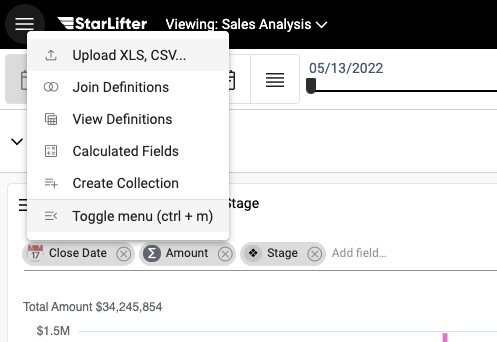
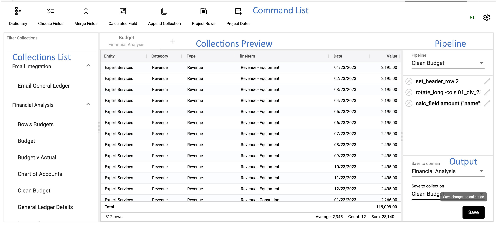

## Accessing Clean and Reformat

[Video Tutorial](https://youtu.be/9gMl5IKxzNM?feature=shared)

StarLifter offers you the ability to clean your data so it is ready to analyze. While basic cleaning can be accomplished in a collection, more complex cleaning is done in Clean and Reformat.

### Accessing Clean and Reformat
1. From the menu at the upper left of the screen, select Toggle menu

</img>

2. Select Clean and Reformat under the Data Manipulation dropdown

</img>

### Clean and Reformat layout
The layout of Clean and Reformat includes the sections below:

* **Collections List:** Collections available for cleanup
* **Pipeline:** Save lists of commands used to clean and reformat a collection
* **Collection Preview:** Preview of the collection actively being cleaned by pipeline commands
* **Command List:** Advanced pipeline commands
* **Output:** Save and overwrite collections

</img>

To ask others how they are using this functionality, head over to the [StarLifter Community](https://community.starlifter.io).
