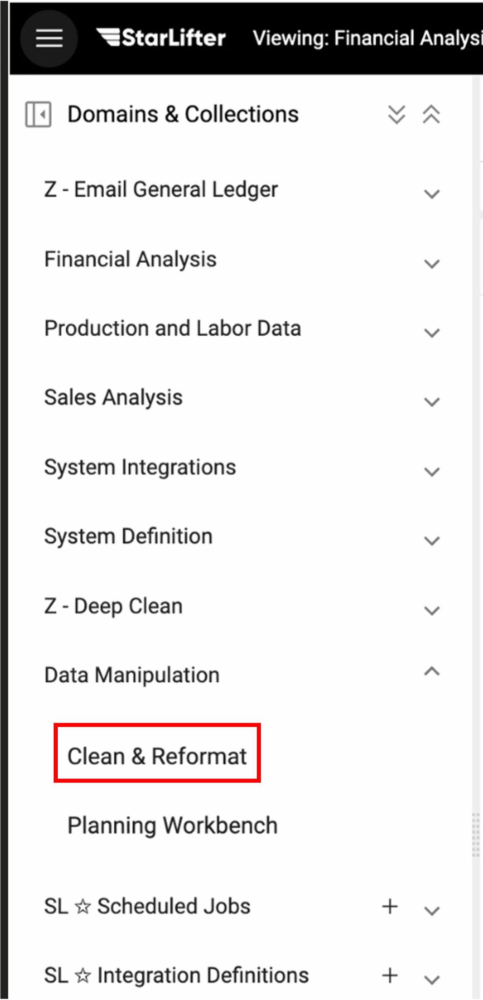

## Accessing Clean and Reformat
StarLifter offers users the ability for users to clean and reformat their data so it is ready to analyze. This is done in the Clean and Reformat section of StarLifter, where users can apply a series of commands to an existing collection to output cleaned and reformatted collections.

### Accessing Clean and Reformat
1. To access Clean and Reformat, use control + shift + m to open the maintenance menu
2. Select Clean and Reformat under the Data Manipulation dropdown

</img>

### Clean and Reformat layout
The layout of Clean and Reformat includes the secions below.

* **Collections List:** Collections available for cleanup
* **Collection Preview:** Preview of the collection activeley being cleaned by pipeline commands
* **Command List:** Advanced pipeline commands
* **Pipeline:**  Save lists of commands used to clean and reformat a collection
* **Output:** Save and overwrite collections

</img>
