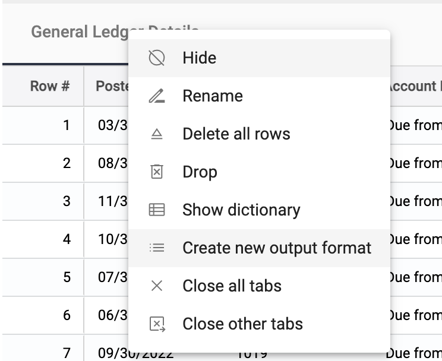
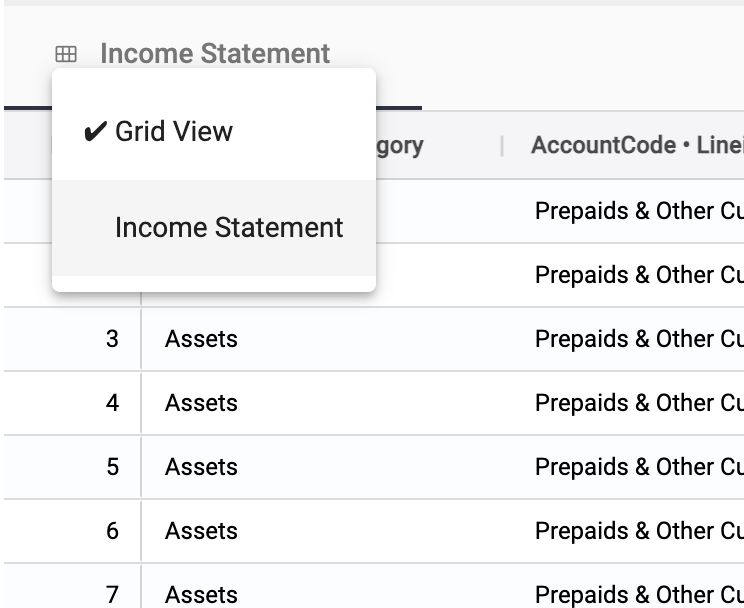
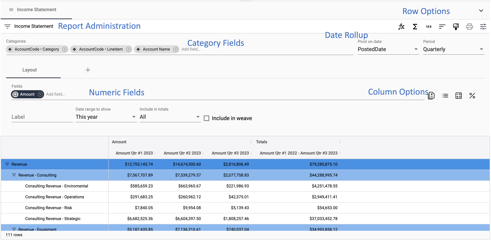

## Accessing table reporting

[**Video Tutorial**](https://youtu.be/fLLjW7BHojw?feature=shared)

StarLifter offers you the ability to create and save alternate views to collection data. For example, raw general ledger data that references a chart of accounts can be used to build an income statement, or daily production reports can be pivoted to create annual summaries.

### Accessing table reporting
1. For collections without an existing table report, right-click on the collection and select **Create a new output format**.

</img>

2. If a saved table report already exists, click the grid icon on the collection header and select the saved report.

</img>

### Table reporting layout
The layout of StarLifter table reporting includes the sections below:

* **Report Administration:** Save and delete reports from the collection
* **Category Fields:** Add, drop, and reorder character fields to set the report hierarchy
* **Numeric Fields:** Add, drop, and reorder numeric fields which are pivoted according to the report setup
* **Date Rollup:** Date field and frequency for the numeric field rollup
* **Column Options:** Additional options to add or edit columns
* **Row Options:** Additional options to add or edit rows 

</img>