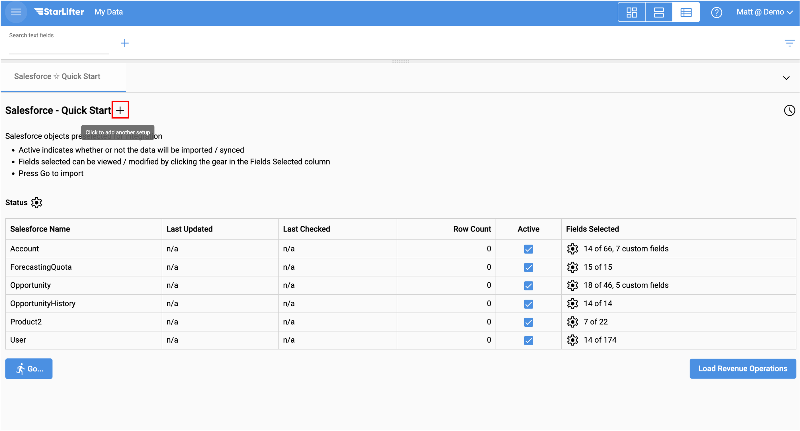
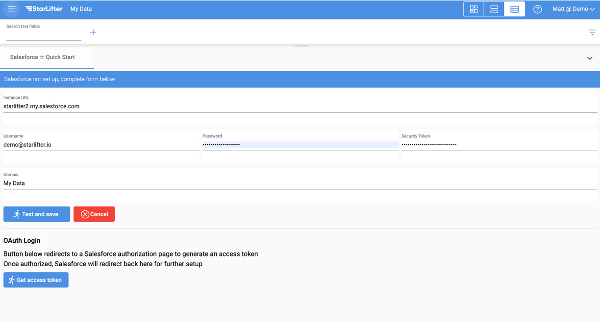
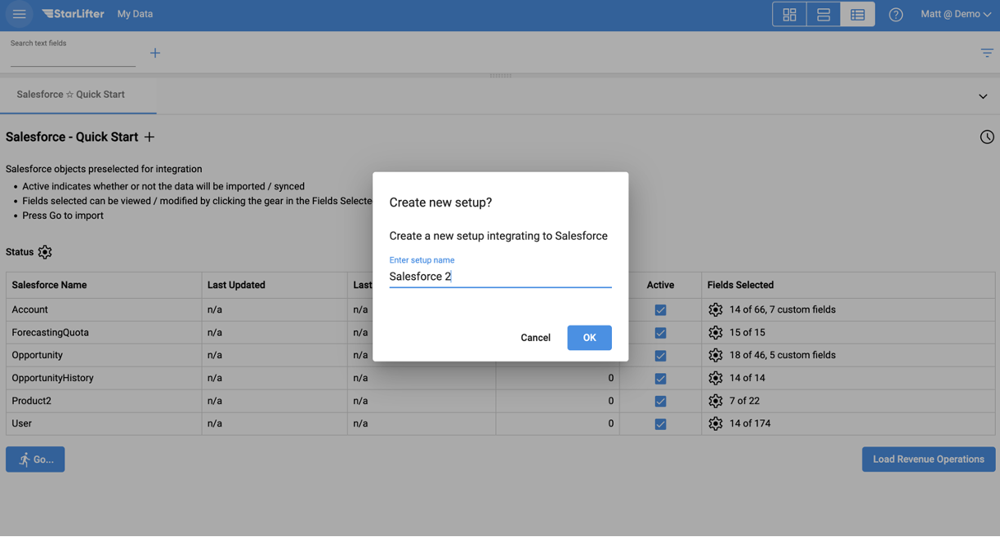
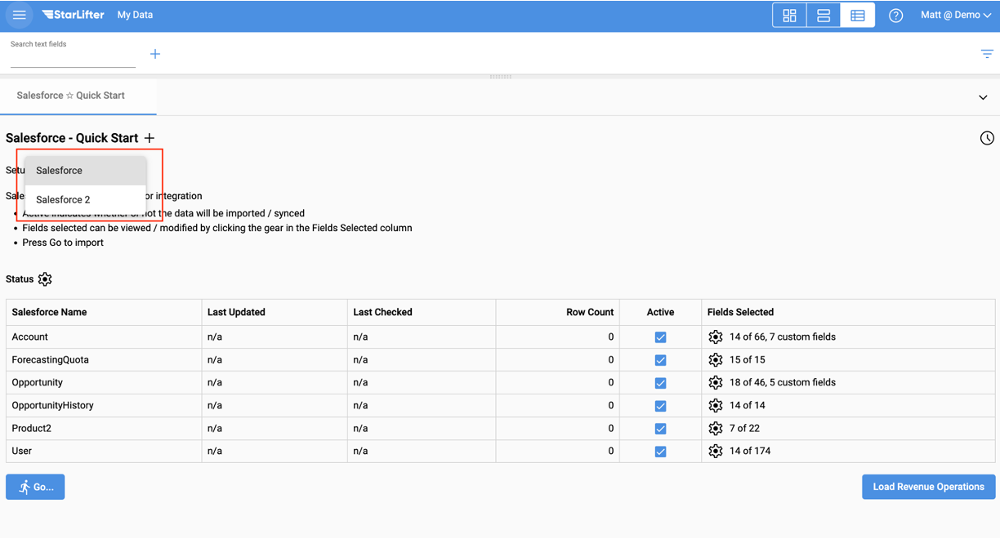
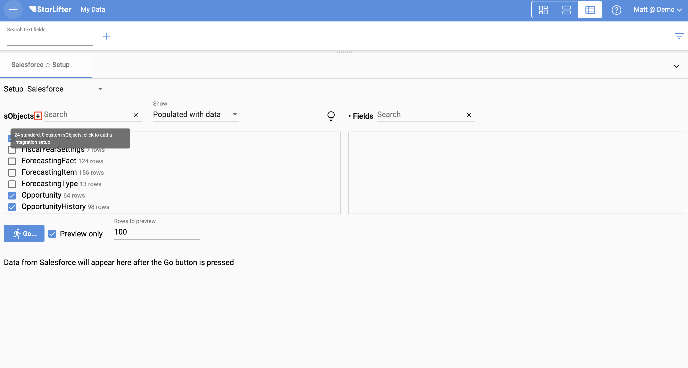

## Adding another API configuration

StarLifter makes it possible to integrate with multiple instances of a source system by setting up an additional API configuration

### How to set up an additional API configuration
1. From the API Quick Start menu, click the **+** button.

</img>

2. Enter the credentials for your source system, and click **Test and save**. For more information on entering API credentials for your specific source system, access the documentation below:

* [**Salesforce**](https://docs.starlifter.io/#/how_to/salesforce_api)

* [**Hubspot**](https://docs.starlifter.io/#/how_to/hubspot_api)

* [**QuickBooks**](https://docs.starlifter.io/#/how_to/quickbooks_api)

* [**NetSuite**](https://docs.starlifter.io/#/how_to/netsuite_api)

</img>

3. Name the new configuration, and click **OK**.

</img>

4. You are now able to access the additional configuration from the **Setup** dropdown on the Quick Start menu.

</img>

5. If your API connection does not have a Quick Start menu, you can add an additional configuration by clicking the **+** on the API Setup screen.

</img>

