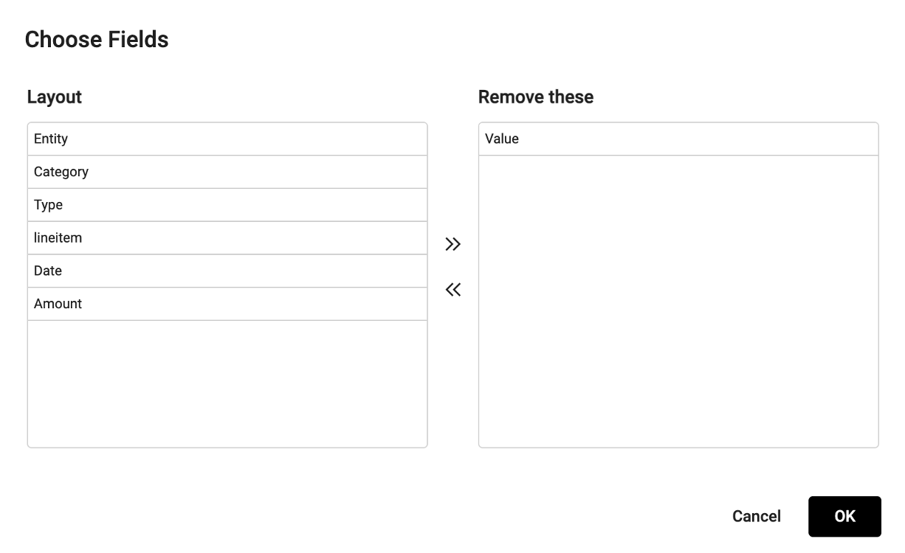
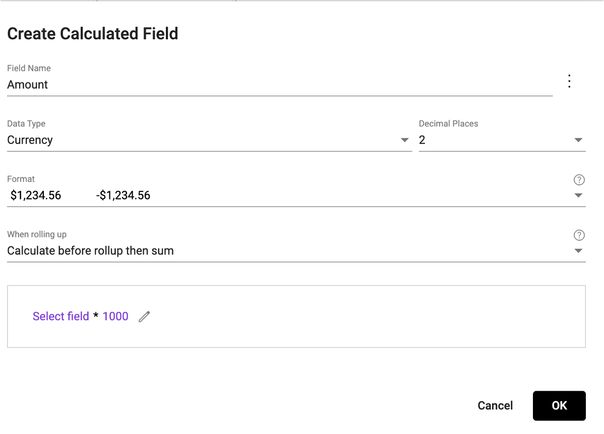

## Advanced transformer commands

[Video Tutorial](https://youtu.be/9gMl5IKxzNM?feature=shared)
To learn about the common transformer commands, start with the [Create a pipeline](url) article. 

### Command toolbar
More complex commands can be accessed using the toolbar at the top of the screen.

</img>

**Dictionary:** Edit the collection dictionary (change data type, format, etc)

</img>

**Choose Fields**: Edit the layout of a collection, including removing fields

</img>

**Merge Fields:** Concatenate the values of two fields in the same row

**Calculated Field:** Create a calculated field within the collection

</img>

**Append Collection:** Append data from another collection

</img>

**Project Rows:** Project rows from another collection into the collection

**Project Dates:** Project monthly, quarterly, or yearly dates into the collection

### Grouping and appending a collection
Grouping collections in StarLifter can be accomplished using two different methods.

**1. Drag and drop:**

Drag and drop a collection from the collection list on top of the collection tab in the collection preview. 

</img>

Continue adding more collections to the group by dragging and dropping. Pipeline commands will be applied to all collections in the group. Saving will output a single collection that includes the cleaned data from each collection in the group.

**2. Appending a collection:**

Select the collection from which you wish to append data.

You have the options of applying a tag to the appended data. The tag will appear in an additional column. If you do not wish to apply a tag, StarLifter will apply the collection name as a tag.

</img>

Select how to append fields to the collection by choosing one of the following actions:
* **Ignore field:** Do not append this field to the collection
* **Copy to field:** Match this field to a field in the collection
* **Create new field:** Create a new field to the collection

</img>

To learn from others how they are using this functionality, head over to the [StarLifter Community](https://community.starlifter.io).
