## Calculated Fields

[**Video Tutorial**](https://youtu.be/OyMBUbcwdo8?feature=shared)

Use calculated fields when you want to change data based on other values in the same row. These actions range from basic mathematical operations to if-then statements to advanced Javascript calculations.  

## How to create a calculation
Use a calculation to derive new values in a collection.

To create a calculation:

1.	Right click ➔ **Calculated fields**

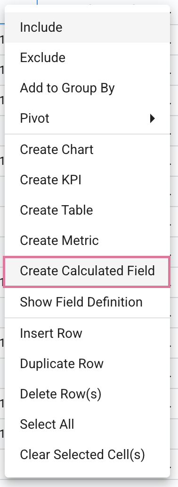</img>

2.  Enter a **Name** and select a data **Type** for the field

</img>

3.  Choose the format of the data type

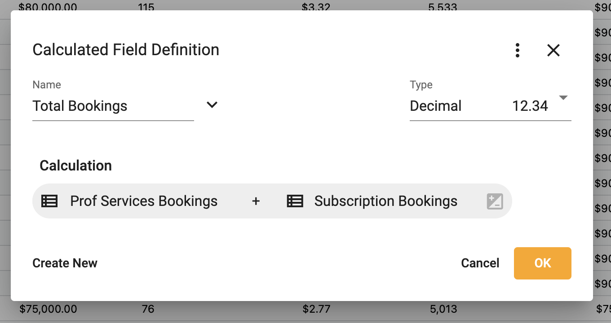</img>

4. Select the timing of aggregation when rolled-up

    For more information on aggregation timing visit [How to the aggregate](https://docs.starlifter.io/#/how_to/calculate?id=how-to-set-aggregate)

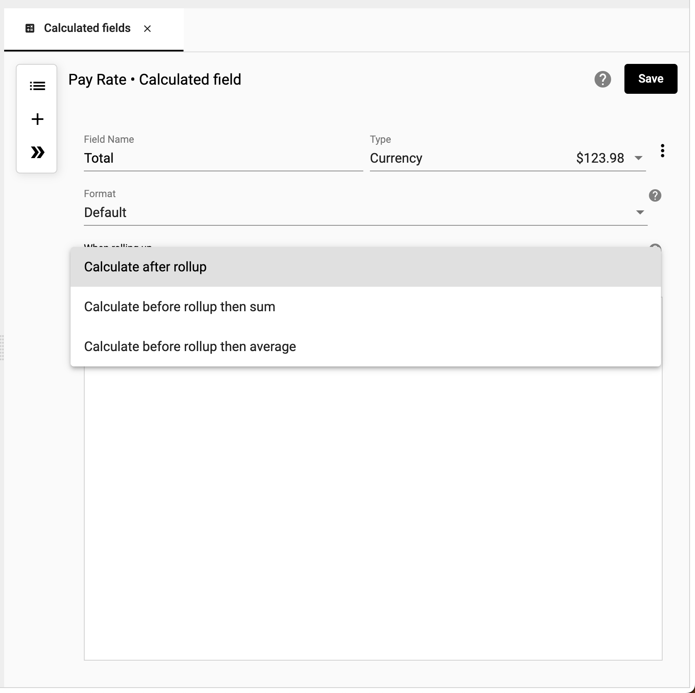</img>

5.  Select the elements to build your calculation. Input a **Field**, **Number**, or **Text**, or use an **IF** or **Function**

    For a list of available functions visit [Functions](https://docs.starlifter.io/#/how_to/functions)

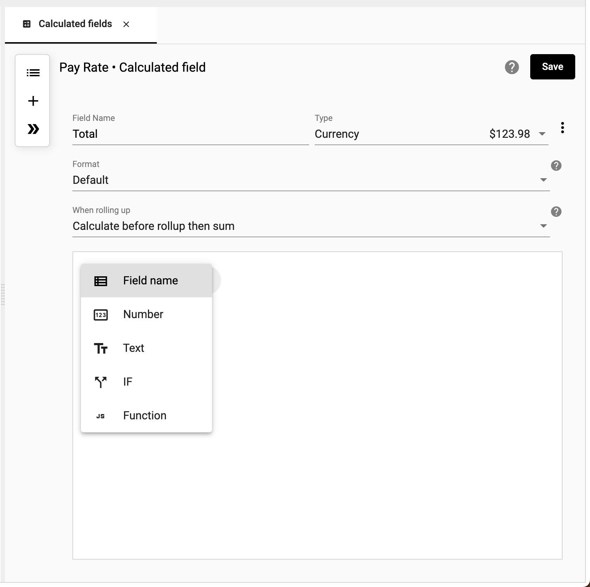</img>

6.  Select **Save**

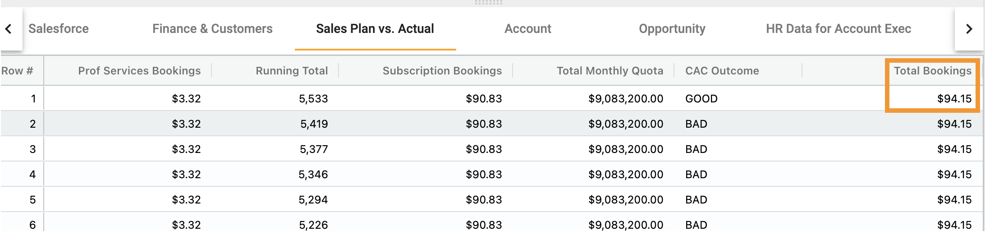</img>

7.  The calculation is now part of the collection.

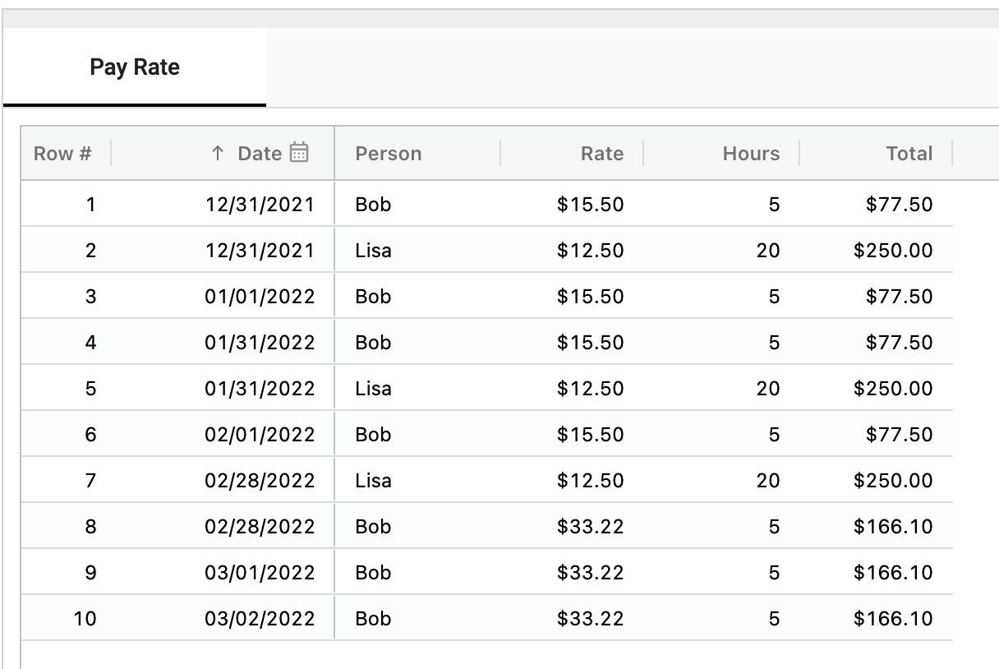</img>

## How to set the aggregate
Setting the aggregate allows you to determine if you want to calculate your values before rolling up the data or after the roll-up has occurred.

## When to calculate before or after roll-up

Values differ based on whether data is aggregated (rolled up) before or after a calculation.

### Calculate before roll-up
 *The goal is to calculate Bob’s total pay per year.*
  
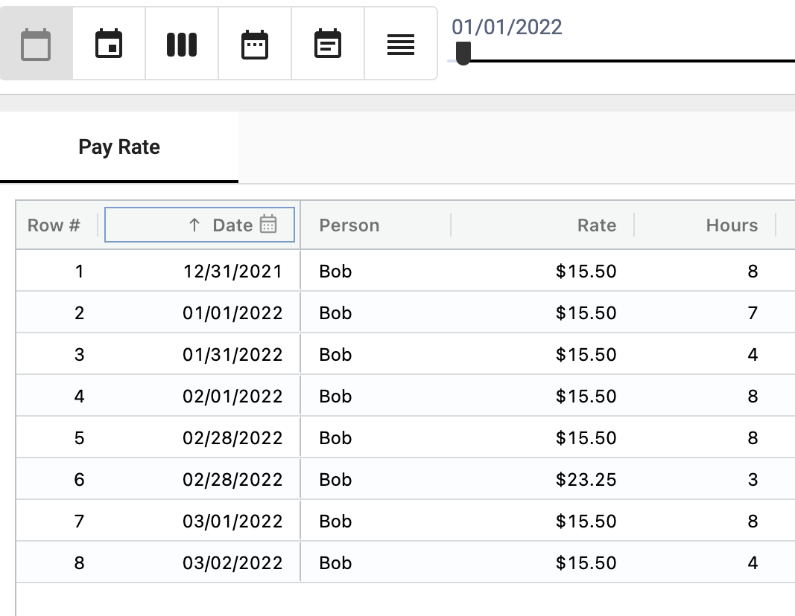</img>

1. First, create a calculated field. Multiply Rate by Hours.

2.	Choose ‘Calculate before rollup then sum’.

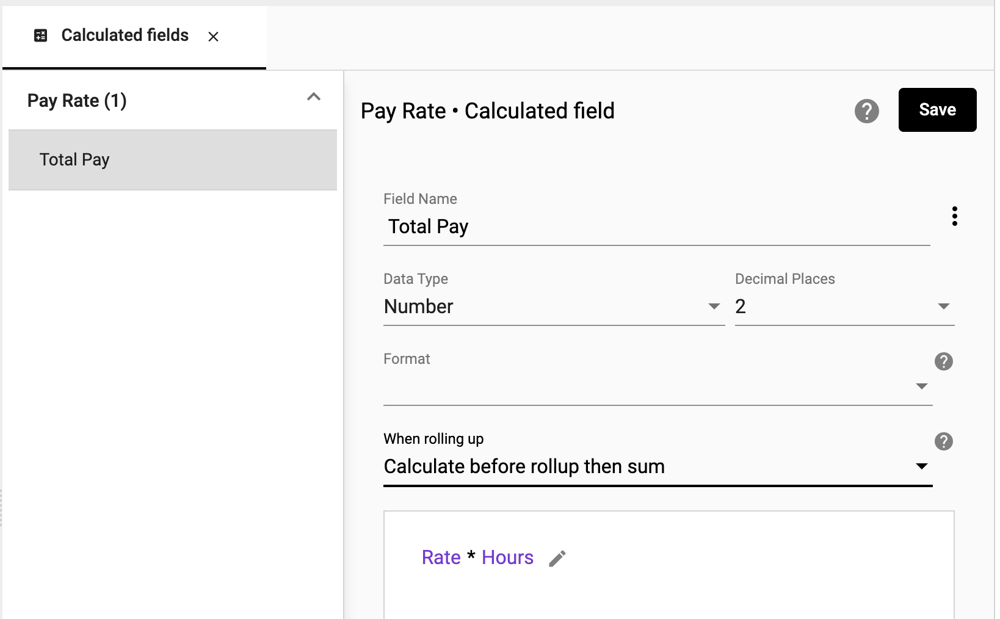</img>

- This means the calculation multiplies Rate ($15.50) * Hours (8 hours) and then calculates a subtotal per year.

3. Total Pay is calculated for each day.  For example, Bob earned $124 on December 31, 2021, by working 8 hours for $15.50 per hour.

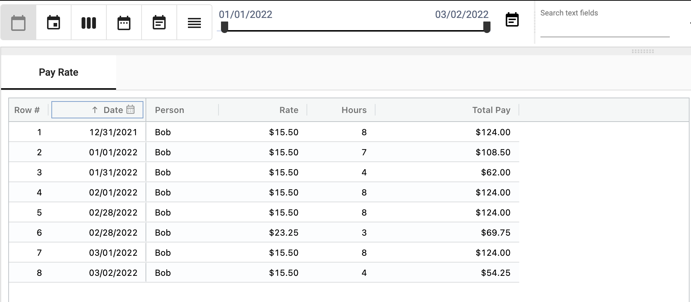</img>

4. Now, roll-up by year. Bob earned $124 in 2021 and $666.50 in 2022. This works as expected since ‘Calculate before rollup then sum’ was selected.

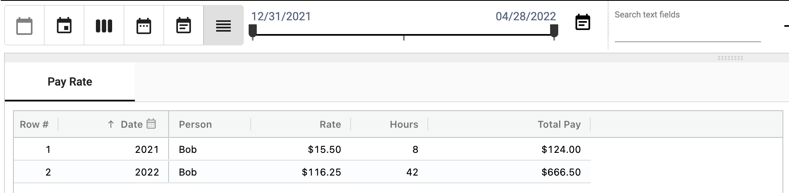</img>

**Note: If you were to choose ‘Calculate after rollup then sum’, pay would be calculated incorrectly.  The Rates and Hours would be summed by year and multiplied together.  For example, 2022 Total Pay would be $4,882.50 based on an hourly rate of $116.25 and 42 Hours.**

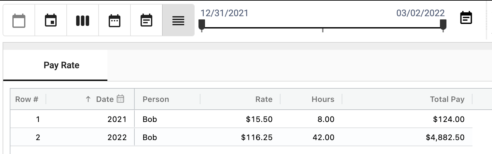</img>

### Calculate after roll-up
 *The goal is to calculate the average boxes per bin per month.*
  

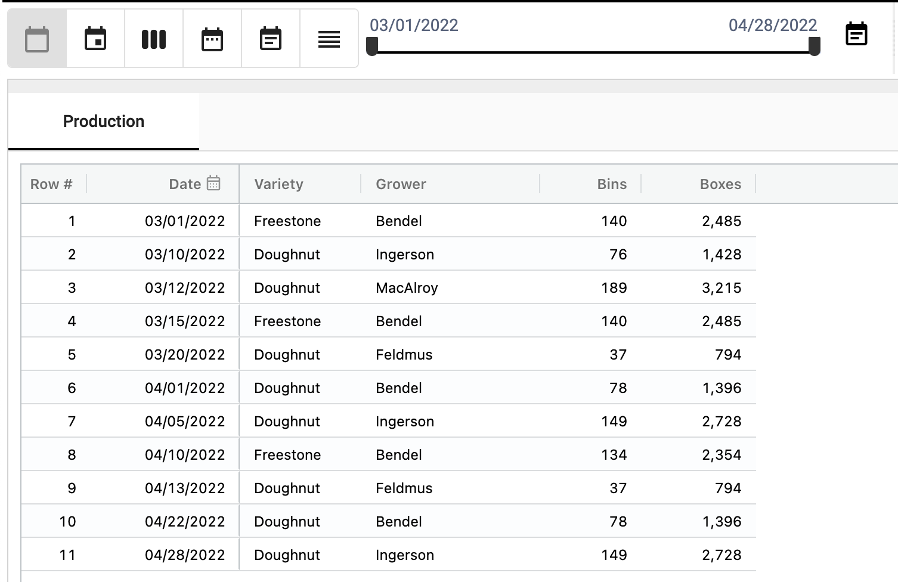</img>

1. Create a calculated field and choose ‘Calculate after rollup then sum’

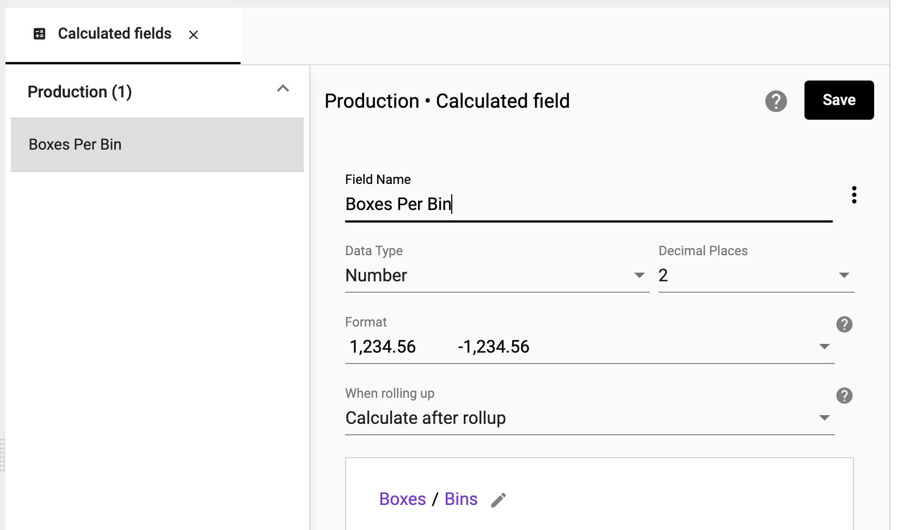</img>

2. Boxes per bin is calculated for each day.  On 3/1/2022, boxes were 2,485 and bins were 140; thus, boxes per bin was 17.75.

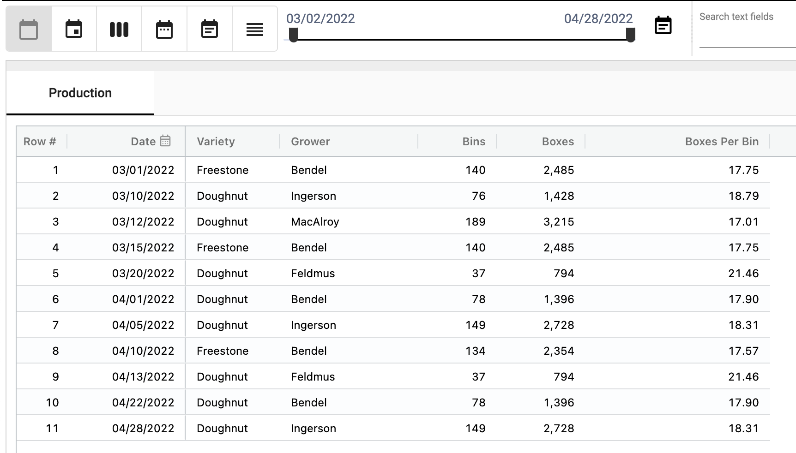</img>

3. Now, roll-up by month.  Boxes per bin were 17.88 for March and 18.23 in April. This works as expected since ‘Calculate after rollup then sum’ was selected.

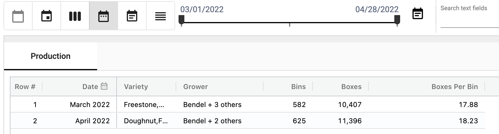</img>

**Note: If you were to choose ‘Calculate before rollup then sum’, boxes per bin would have calculated incorrectly.  Daily boxes per bin would have been calcualted and then totaled; thus, the boxes per bin would have been 92.72 in March and 111.44 in April.**

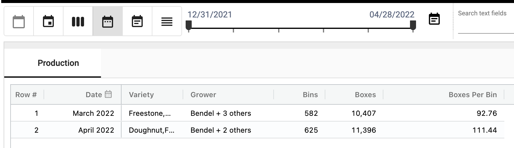</img>

To learn more about how others are using this functionality, head over to the [StarLifter Community](https://community.starlifter.io).
