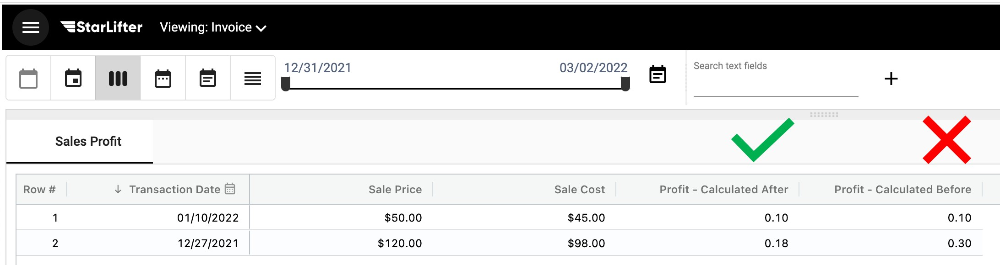

## Calculated Fields
Use calculated fields when you want to change data based on other values in the same row. These actions range from basic mathematical operations to if-then statements, to advanced Javascript calculations.   

## How to create a calculation
How-to video link - https://youtu.be/pC5Fmbb7r1A

Use a calculation to derive new values in a collection.

To create a calculation:

1.	Right click ➔ **Calculated fields**

</img>

2.  Enter a **Name** and select a **Type** for field

</img>

3.  Choose the format of the data type

</img>

4. Select the select the timing of aggregation when rolled up

    For more information on aggregation timing visit [How to the aggregate](https://docs.starlifter.io/#/how_to/calculate?id=how-to-set-aggregate)

</img>

5.  Select the elements to build your calculation. Input a **Field** **Number** or **Text**, or use an **IF** or **Function**

    For a list of available functions visit [Functions](https://docs.starlifter.io/#/how_to/functions)

</img>

4.  Select **Save**

</img>

6.  The calculation is now part of the collection.

</img>

## How to set the aggregate
Setting the aggregate allows you to determine if you want to calculate your values prior to rolling up the data or after the roll up has occurred.

## Calculated Fields
Use calculated fields when you want to change data based on other values in the same row. These actions range from basic mathematical operations to if-then statements, to advanced Javascript calculations.   

## How to create a calculation
How-to video link - https://youtu.be/pC5Fmbb7r1A

Use a calculation to derive new values in a collection.

To create a calculation:

1.	Right click ➔ **Calculated fields**

</img>

2.  Enter a **Name** and select a **Type** for field

</img>

3.  Choose the format of the data type

</img>

4. Select the select the timing of aggregation when rolled up

    For more information on aggregation timing visit [How to the aggregate](https://docs.starlifter.io/#/how_to/calculate?id=how-to-set-aggregate)

</img>

5.  Select the elements to build your calculation. Input a **Field** **Number** or **Text**, or use an **IF** or **Function**

    For a list of available functions visit [Functions](https://docs.starlifter.io/#/how_to/functions)

</img>

4.  Select **Save**

</img>

6.  The calculation is now part of the collection.

</img>

## How to order aggregations in calculated fields
Values differ based on whether data is aggregated before or after the calculation.

The following examples demonstrate each use case.

### Example - Calculate before roll up
 *How do we correctly calculate Bob's total pay over a rolled up period?*
- 2 Calculated fields have been created multiplying Hours by Rate.
</img>
</img>

- Prior to rollup the data is calculated correctly

</img>

### Once rolled up 

- ✅ Total - Calculated Before - Summed the result of each calucated field
- ❌ Total - Calculated After - Calculated the value of rolled up Rate by the of rolled up Hours

</img>

### Example 2 - Calcualting Profit after rolling up
### How do we correctly calculate Sales Profit over a rolled up period?
- 2 Calculated fields have been created multiplying (Sale Price - Sale Cost)/Sale Price.
- Prior to rollup the data is calculated correctly

</img>

### Once rolled up 
- ❌ Profit - Calculated Before - Summed the result of each calucated field
- ✅ Profit - Calculated After -  Calculated the value of rolled up Sales Price and Sales Cost

</img>
