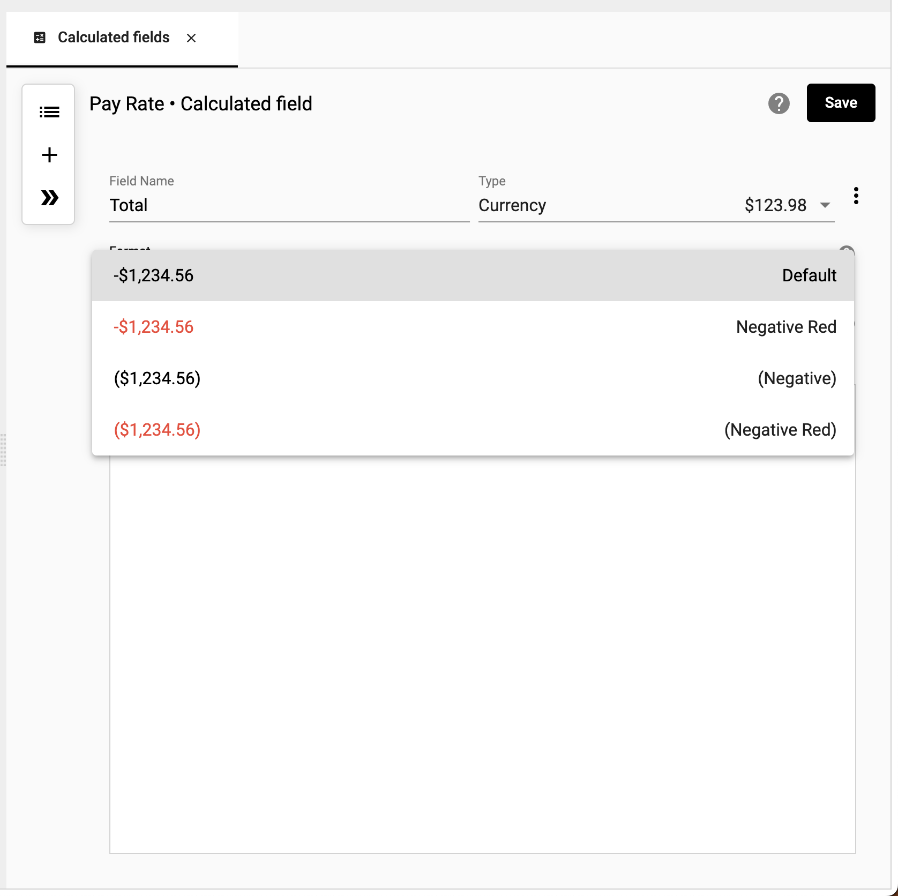

## Calculated Fields
Use calculated fields when you want to change data based on other values in the same row. These actions range from basic mathematical operations to if-then statements, to advanced Javascript calculations.   

## How to create a calculation
How-to video link - https://youtu.be/pC5Fmbb7r1A

Use a calculation to derive new values in a collection.

To create a calculation:

1.	Right click ➔ **Calculated fields**

</img>

2.  Enter a **Name** and select a **Type** for field

</img>

3.  Choose the format of the data type

</img>

4. Select the select the timing of aggregation when rolled up

    For more information on aggregation timing visit [How to the aggregate](https://docs.starlifter.io/#/how_to/calculate?id=how-to-set-aggregate)

</img>

5.  Select the elements to build your calculation. Input a **Field** **Number** or **Text**, or use an **IF** or **Function**

    For a list of available functions visit [Functions](https://docs.starlifter.io/#/how_to/functions)

</img>

4.  Select **Save**

</img>

6.  The calculation is now part of the collection.

</img>

## How to set the aggregate
Setting the aggregate allows you to determine if you want to calculate your values prior to rolling up the data or after the roll up has occurred.

## Calculated Fields
Use calculated fields when you want to change data based on other values in the same row. These actions range from basic mathematical operations to if-then statements, to advanced Javascript calculations.   

## How to create a calculation
How-to video link - https://youtu.be/pC5Fmbb7r1A

Use a calculation to derive new values in a collection.

To create a calculation:

1.	Right click ➔ **Calculated fields**

</img>

2.  Enter a **Name** and select a **Type** for field

</img>

3.  Choose the format of the data type

</img>

4. Select the select the timing of aggregation when rolled up

    For more information on aggregation timing visit [How to the aggregate](https://docs.starlifter.io/#/how_to/calculate?id=how-to-set-aggregate)

</img>

5.  Select the elements to build your calculation. Input a **Field** **Number** or **Text**, or use an **IF** or **Function**

    For a list of available functions visit [Functions](https://docs.starlifter.io/#/how_to/functions)

</img>

4.  Select **Save**

</img>

6.  The calculation is now part of the collection.

</img>

## How to set the aggregate
Setting the aggregate allows you to determine if you want to calculate your values prior to rolling up the data or after the roll up has occurred.

The following examples demonstrate each use case.

Example 1 - Calcualting Pay Rate based on (Hours X Rate)

</img>

</img>

Example 2 - Calcualting Profit

</img>

</img>
