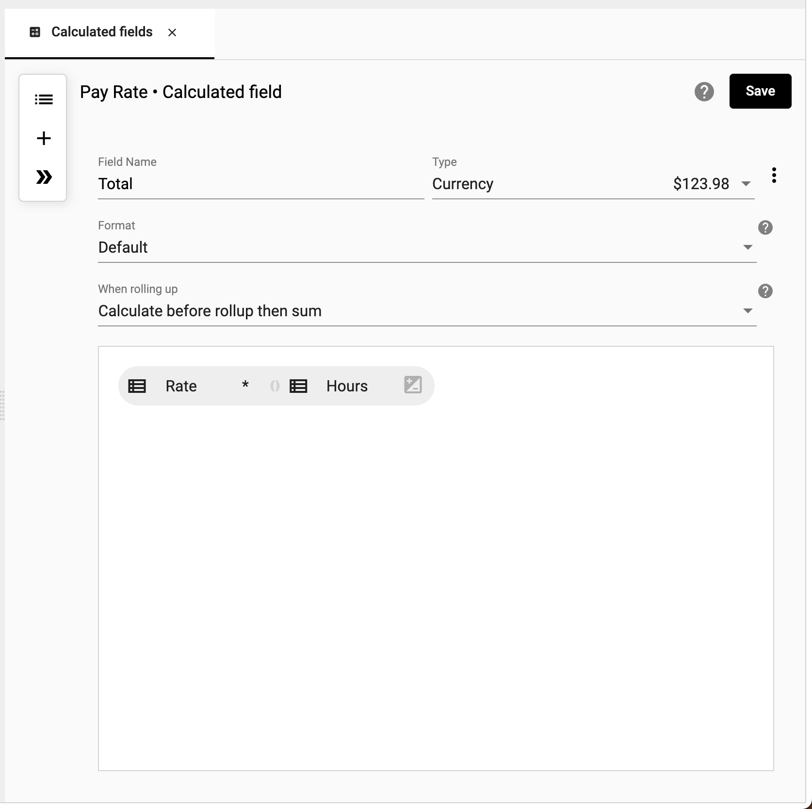

## Calculated Fields
Calculated fields can manipliate data based on other values in the same row. These actions range from basic mathematical operations like simple addition or subtraction, to more complex logical tests, to advanced Javascript calculations. 

## How to create a calculation
How-to video link - https://youtu.be/pC5Fmbb7r1A

Use a calculation to derive new values in a collection.

To create a calculation:

1.	Right click ➔ **Calculated fields**

</img>

2.  Choose a **Field Name** from the collection, input a **Number** or **Text**, or use an **IF** or **Function**

</img>

</img>

</img>

3.  Choose the **Type** of data value from the dropdown

</img>

4.  Select **OK**
5.  The calculation in now part of the collection.

</img>

