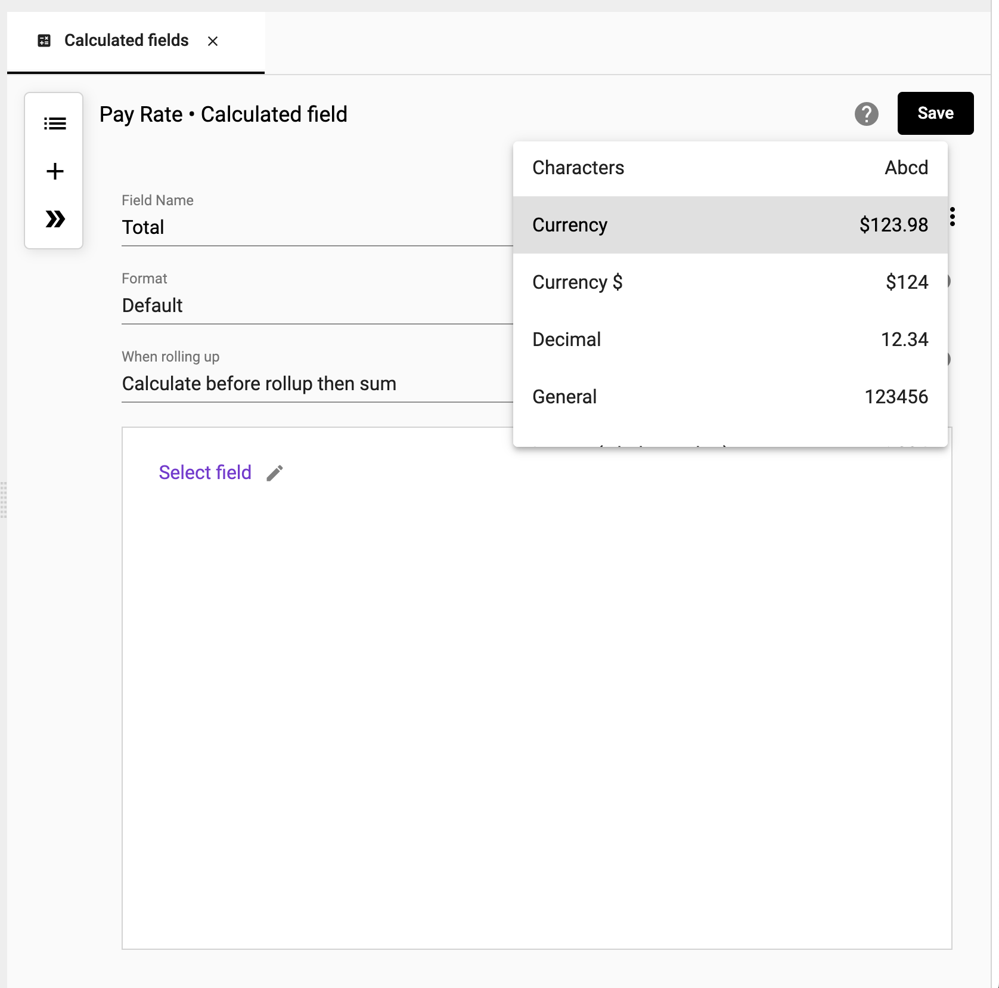

## Calculated Fields
Use calculated fields when you want to change data based on other values in the same row. These actions range from basic mathematical operations to if-then statements, to advanced Javascript calculations.   

## How to create a calculation
How-to video link - https://youtu.be/pC5Fmbb7r1A

Use a calculation to derive new values in a collection.

To create a calculation:

1.	Right click ➔ **Calculated fields**

</img>

2.  Enter a **Name** and select a **Type** for field

</img>

3.  Choose the format of the data type

</img>

4. Select the timing of aggregation when rolled-up

    For more information on aggregation timing visit [How to the aggregate](https://docs.starlifter.io/#/how_to/calculate?id=how-to-set-aggregate)

</img>

5.  Select the elements to build your calculation. Input a **Field** **Number** or **Text**, or use an **IF** or **Function**

    For a list of available functions visit [Functions](https://docs.starlifter.io/#/how_to/functions)

</img>

4.  Select **Save**

</img>

6.  The calculation is now part of the collection.

</img>

## How to set the aggregate
Setting the aggregate allows you to determine if you want to calculate your values before rolling up the data or after the roll-up has occurred.

## Calculated Fields
Use calculated fields when you want to change data based on other values in the same row. These actions range from basic mathematical operations to if-then statements, to advanced Javascript calculations.   

## How to create a calculation
How-to video link - https://youtu.be/pC5Fmbb7r1A

Use a calculation to derive new values in a collection.

To create a calculation:

1.	Right click ➔ **Calculated fields**

</img>

2.  Enter a **Name** and select a **Type** for field

</img>

3.  Choose the format of the data type

</img>

4. Select the select the timing of aggregation when rolled-up

    For more information on aggregation timing visit [When to calculate during a roll-up](https://docs.starlifter.io/#/how_to/calculate?id=how-to-set-aggregate)

</img>

5.  Select the elements to build your calculation. Input a **Field** **Number** or **Text**, or use an **IF** or **Function**

    For a list of available functions visit [Functions](https://docs.starlifter.io/#/how_to/functions)

</img>

4.  Select **Save**

</img>

6.  The calculation is now part of the collection.

</img>

## When to calculate before or after roll-up

Values differ based on whether data is aggregated (rolled up) before or after a calculation.

### Calculate before roll-up
 *The goal is to calculate Bob’s total pay per year.*
 ___
1. First, create a calculated field. Multiply Rate by Hours.  

</img>

2.	Choose ‘Calculate before rollup then sum’.

</img>

- This means the calculation will first multiply Rate ($15.50) * Hours (8 hours) and then calculate a subtotal per year.

3. Total Pay is calculated for each day.  For example, Bob earned $124.00 on December 31, 2021, by working 8 hours for $15.50 per hour.

</img>

4. Now, roll-up by year. Bob earned $124 in 2021 and $666 in 2022. This works as expected since ‘Calculate before rollup then sum’ was selected.

</img>

**Note: If you were to choose ‘Calculate after rollup then sum’, StarLifter would sum the Rates by year, sum the hours by year, and multiply them together.  Meaning, 2022 Total Pay would be $4,882.50 based on an hourly rate of $116.25 and 42 Hours.**

</img>

### Calculate after roll-up
 *The goal is to calculate Sales Profit % period-over-period.*
  
1. Create a calculated field and choose ‘Calculate after rollup then sum’

</img>

2. Sales Profit % is calculated for each day.  For example, on 1/15/2022 Sales of $50 and costs of $45 earned a .10 Profit

</img>

3. Now, roll-up by week.  The Sales Profit % was .10 in for the week of 01/10/2022 and .18 the week of 12/27/2021.  This works as expected since ‘Calculate after rollup then sum’ was selected.

</img>

**Note: If you were to choose ‘Calculate before rollup then sum’, StarLifter would calculate the daily profit and then sum those totals.  Meaning, the Sales Profit % would be .30 the week of 12/27/2021.**
