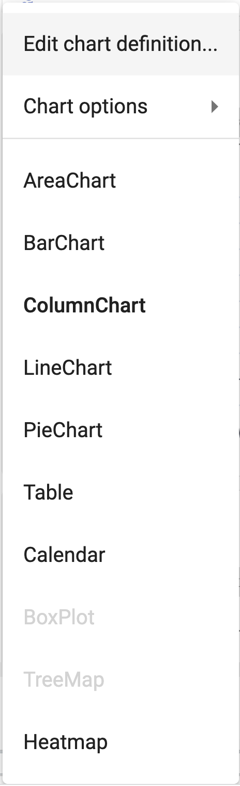
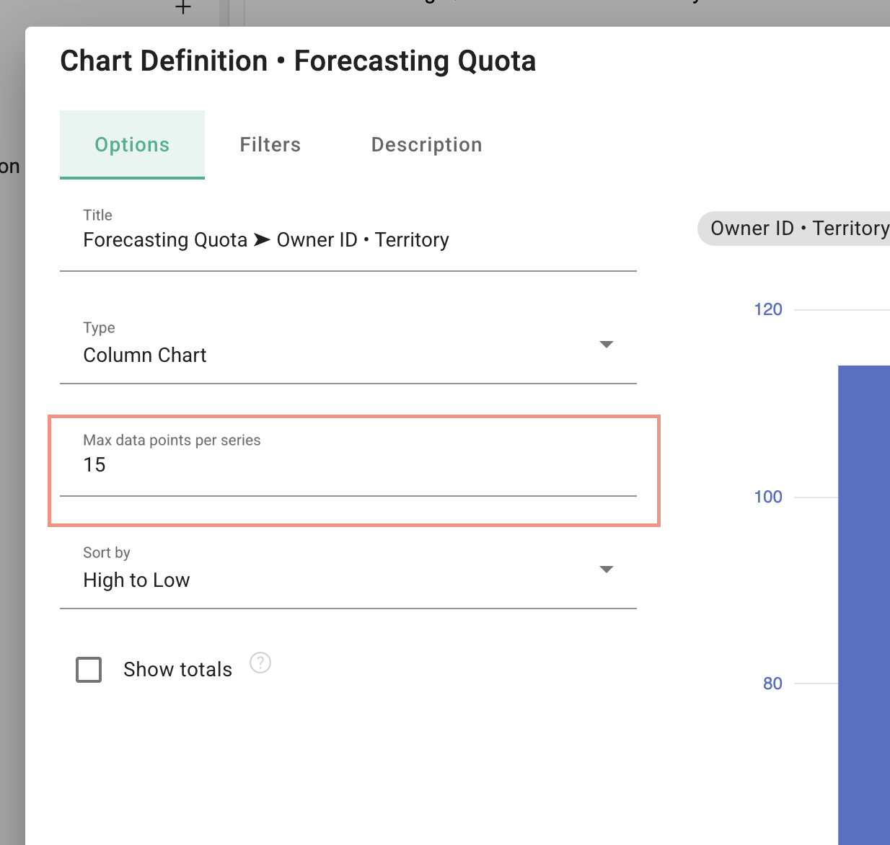

## Change the number of data points on a chart

1.  Click the chart's 3 line menu to open the chart definition

</img>

2.  Enter the number of desired data points into the "Max data points per series" field

</img>

