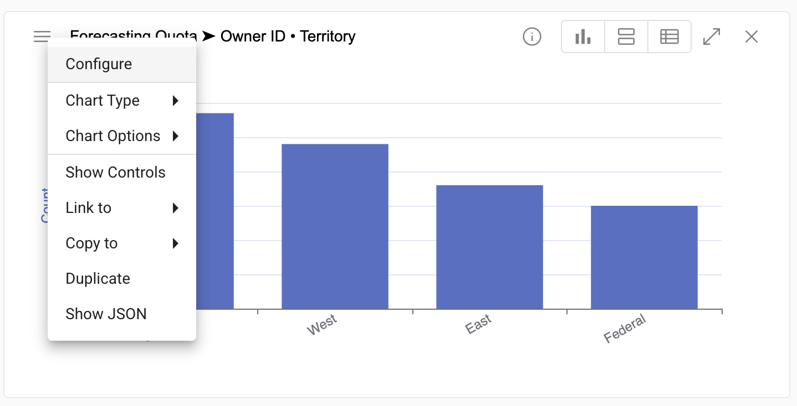

## Changing the number of data points on a chart
If a chart that you create does not display the number of data points you want, you can quickly increase or decrease the data points in the chart definition.

1.  Click the menu in the top left corner of the chart and select **Configure**.

</img>

2.  Enter the number of desired data points into the **Max data points per series** field

</img>