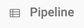

## Icons on Collections
Certain collection types in StarLifter contain an icon next to the name in the collection ribbon, indicating they are an adjusted copy of another collection. There are two primary icons you'll see on collections.  

**View**: This collection is a filtered copy of another collection

</img>

**Join**: This collection is a copy of two source collections merged together based on a key field. 

</img>

To learn more or ask additional questions, head over to the [StarLifter Community](https://community.starlifter.io).
