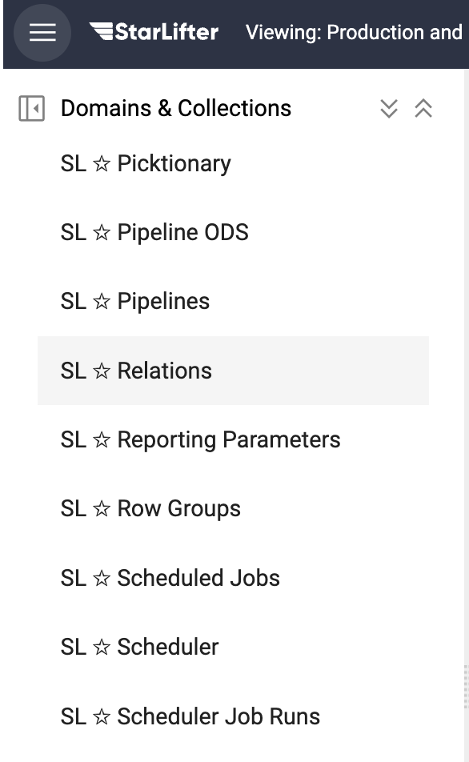

## Create relationships between collections

Relationships between collections can be created so that a single report can include data from multiple collections. For example, production forecast collections can be related to production actual collections for comparison.

### Create relationships between collections
1. Select **SL ☆ Relations**.

</img>

2. Insert a new row, and include the information below:
* **Name:** The name of the relation
* **From:** The collection used for the report
* **From Fields:** The fields in the From collection used to join the two collections
* **To:** The collection from which data is to be added to the report
* **To Fields:** The fields in the To collection used to join the two collections

</img>

3. In the example below, Production Forecast data is now available to be added to the Production Data reports.

</img>

4. Adjust the date range, total, and weave settings as needed.

</img>