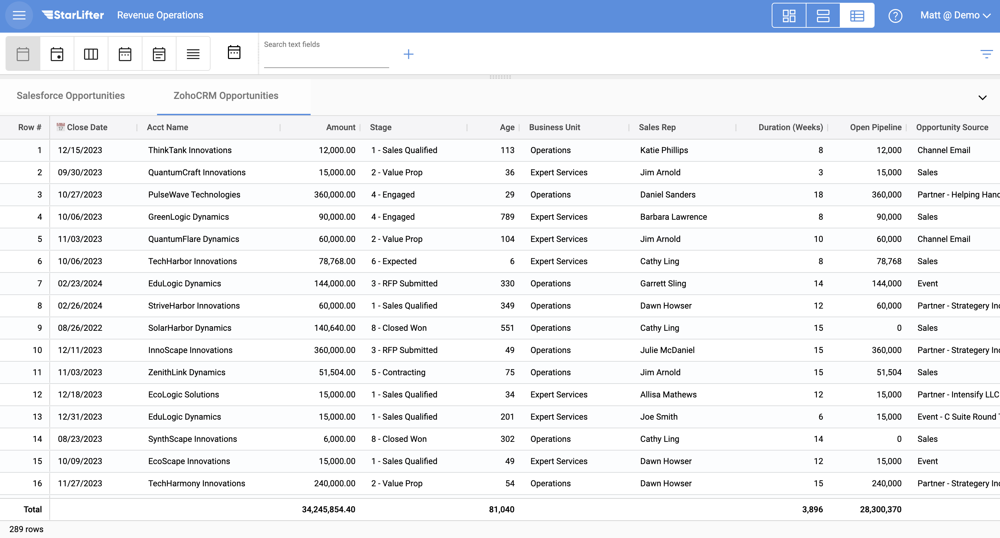
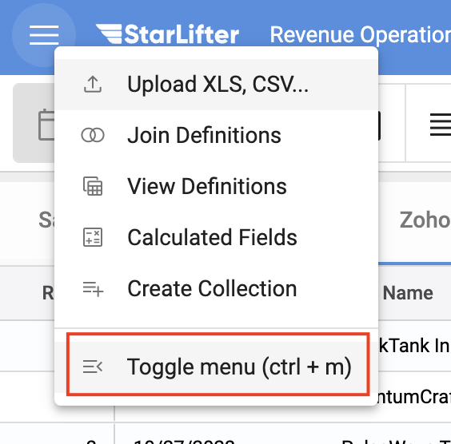

## Combining Data from Multiple CRMs

StarLifter helps you gain a complete view of your company's performance by combining like-data from multiple source systems. In this example, we will show you how to combine data from two separate CRMs into one collection.

</img>

### Append the Opportunity collections
1. 

</img>

2. 

</img>

3. 

</img>

4. 

</img>

5. 

</img>

6. 

</img>

7. 

</img>

8. 

</img>

9. 

</img>

### Normalize the data 
1. 

</img>

2. 

</img>

3. 

</img>

4. 

</img>

5. 

</img>

To learn more or ask additional questions, head over to the [StarLifter Community](https://community.starlifter.io).
