## Combining data from multiple CRMs

StarLifter helps you gain a complete view of your company's performance by combining like-data from multiple source systems. In this example, we will show you how to combine data from two separate CRMs into one collection.

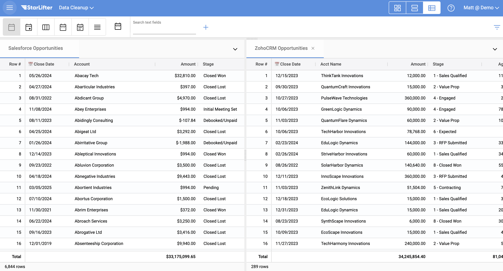</img>

### Append the Opportunity collections

1. Select **Clean & Reformat** under the Data Manipulation dropdown. For more information on Data Manipulation, check out [Create a pipeline](https://docs.starlifter.io/#/how_to/creating_pipeline?id=creating-a-pipeline).

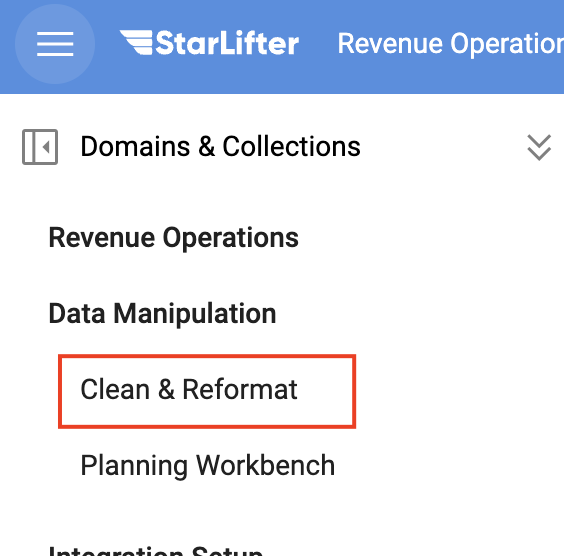</img>

2. Select one of the Opportunity collections (Collection 1) as a starting point. This collection will appear in the middle of the screen.

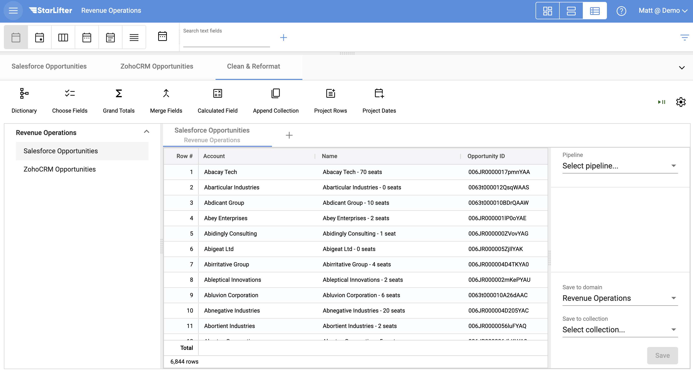</img>

3. Select **Save as...** from the Pipeline dropdown. Name your pipeline and click **OK**. This ensures that your pipeline will be available again for future use.

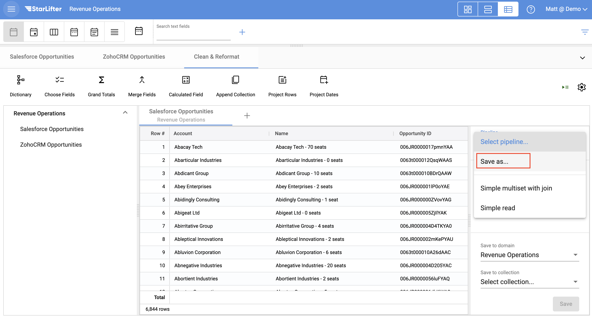</img>

4. Select **Append Collection**.

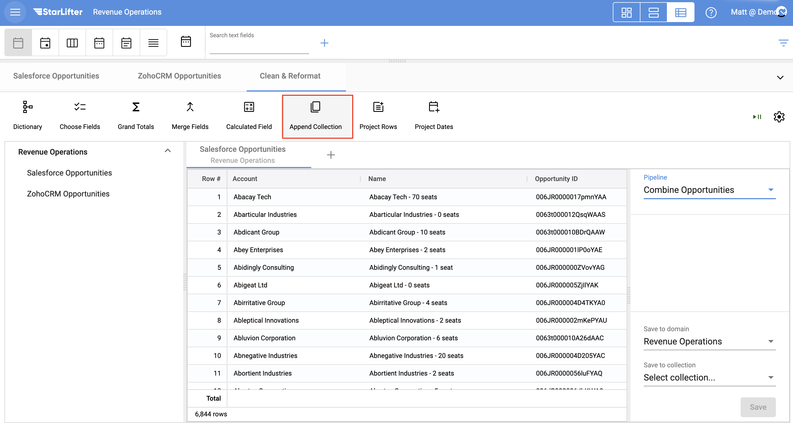</img>

5. Select the other Opportunity Collection (Collection 2) in the **Append from** dropdown. Select the appropriate action for each field.

* **Ignore field**: Do not append the values from this field to Collection 1.
* **Copy to field**: Copy the values from the field in Collection 2 into the field in Collection 1
* **Create new field**: There is no matching field in Collection 1, so Add this field to Collection 1

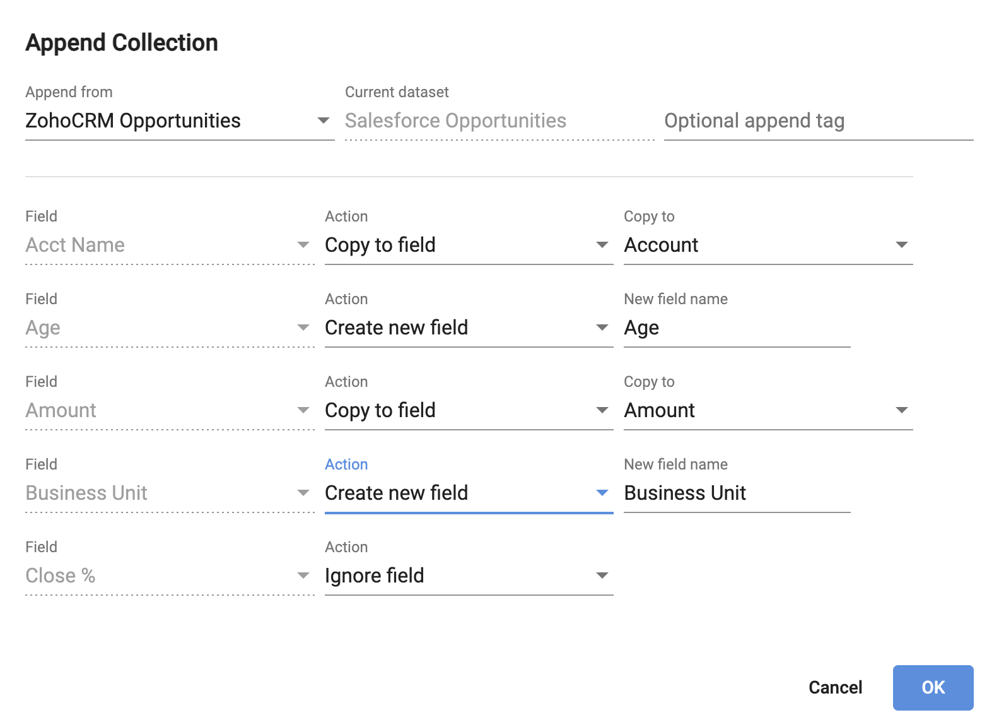</img>

6. Select **Save as...** from the Save to collection dropdown. Name your combined collection and click **OK**.

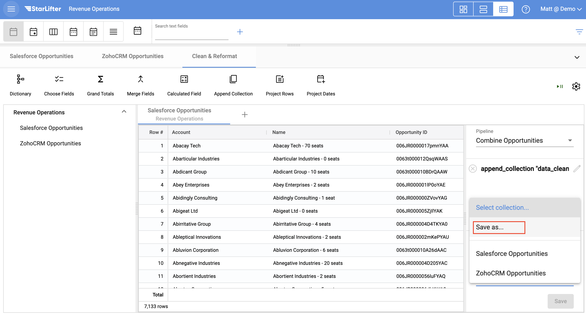</img>

7. The combined collection is now ready for analysis.

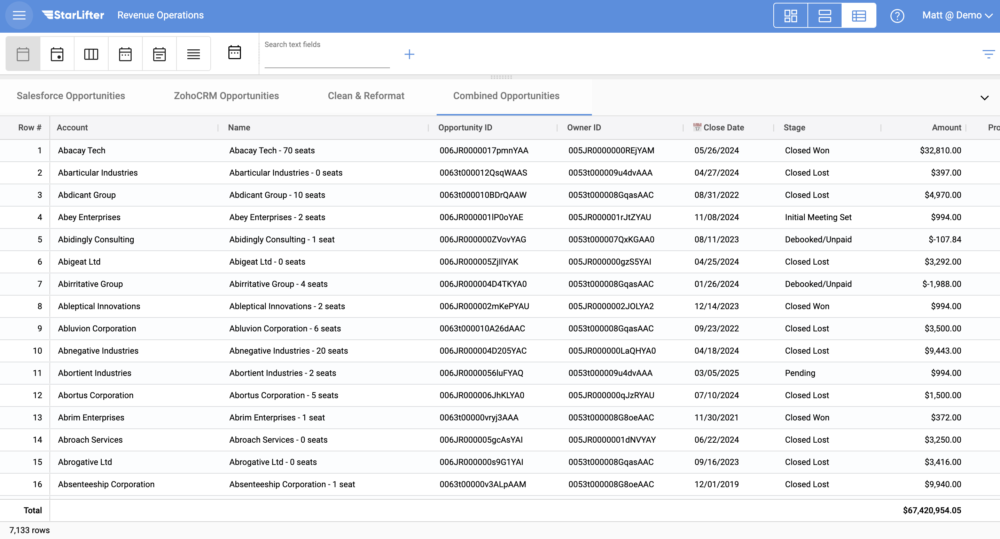</img>

### Normalize the data 
Once that data from your two CRMs is combined, it may be necessary to normalize some of the fields. For example, it is unlikely that the stage names are consistent between the two systems. StarLifter makes it easy to normalize your data.

1. Right click on any of the Stage values, and select **Normalize Field**. Name the Normalization collection.

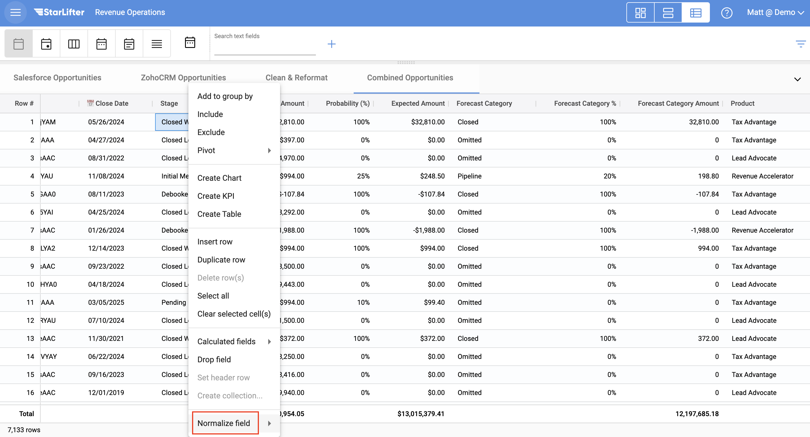</img>

2. Your new Normalization Collection will have two fields: Name and Alias. Rename the values in the Alias field to how you want them to appear for your analysis.

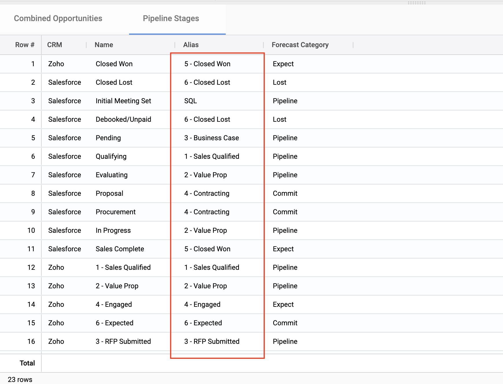</img>

3. Right-click on the header of the Normalization Collection and select Show Dictionary. 

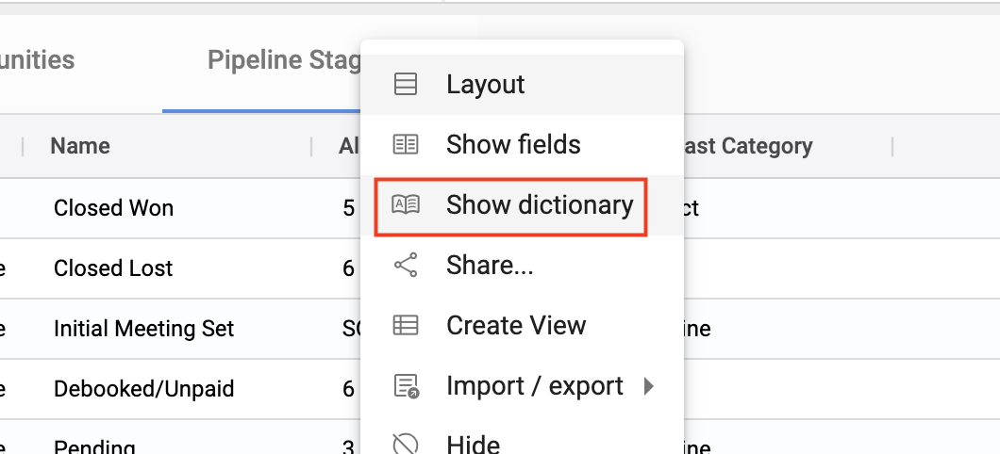</img>

4. Enter a 1 in the **Display Value** for Alias.

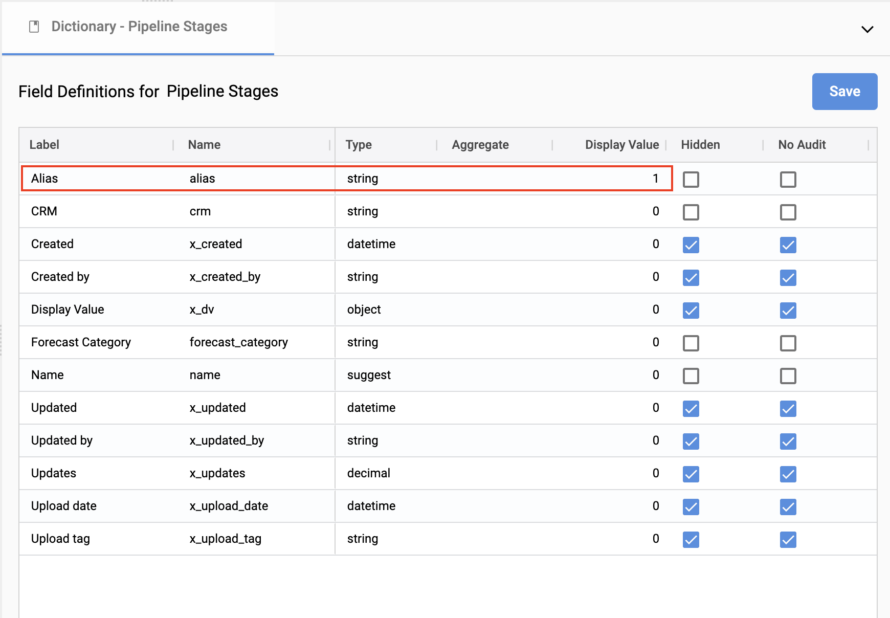</img>

5. Right-click on the combined opportunities header and select **Show fields**. Change the Stage data type to **Reference**. Reference the Normalization collection, and match on **Name**. Click **Save**.

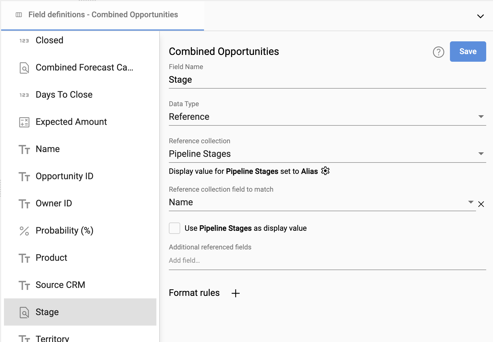</img>

