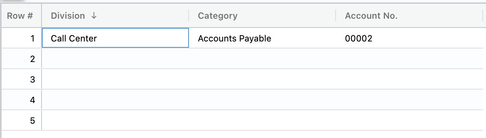
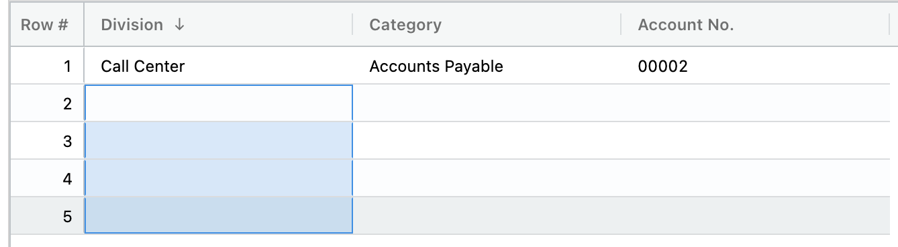
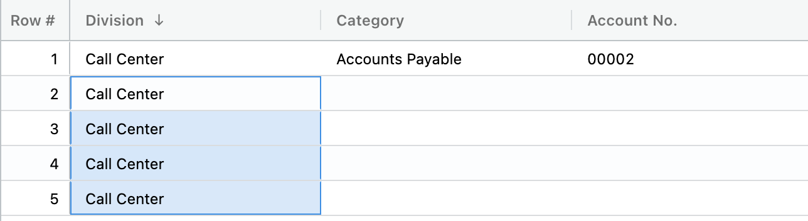
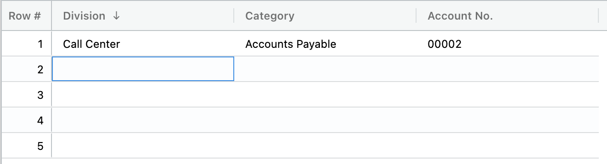

## Copying and pasting data in the grid 

1.  Use Command-C or Control-C while selecting the desired field(s)

</img>

2.  Select one field or a range of fields

</img>

3.  Use Command-V or Control-V 

</img>

4.  If you would like to undo, use Command-Z or Control-Z

</img>
