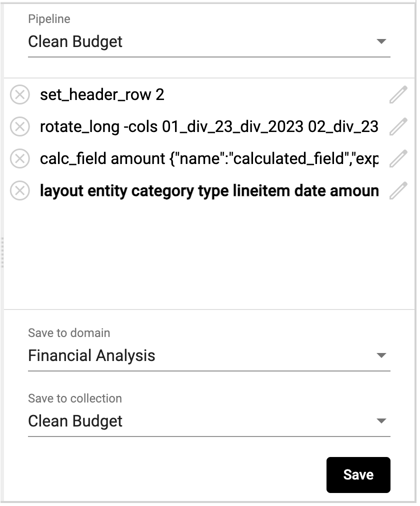
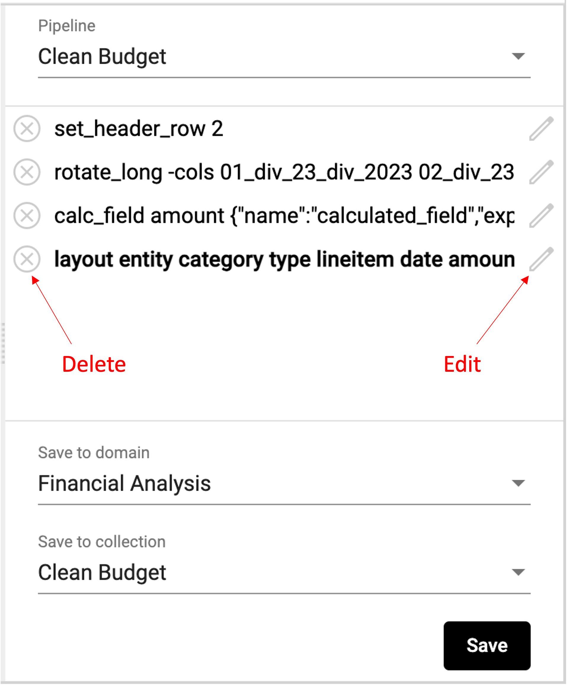
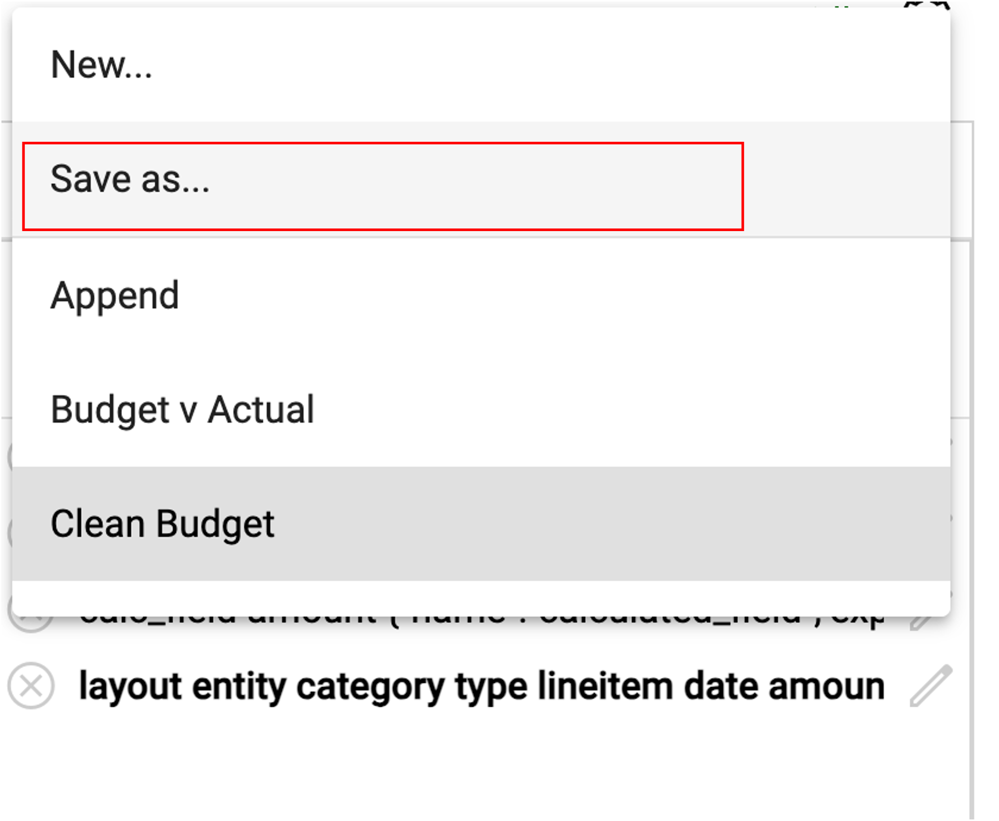
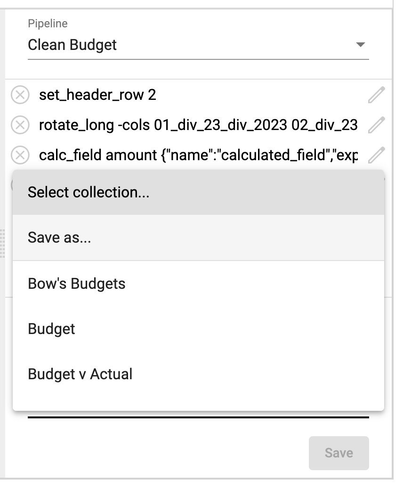
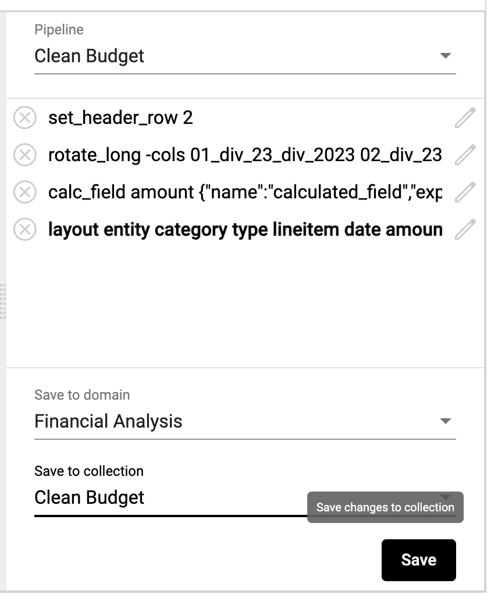

## Creating a pipeline
Users clean and reformat collections by creating lists of commands, or pipelines. Users also have the ability to save pipelines so they can be used again in the future.

A pipeline is applied to a StarLifter collection. To begin, select the collection you wish to clean and reformat.

### Common manipulator commands
The commands below can be accessed by right-clicking within the collection preview.

* **Delete rows like this:** Delete rows that contain the selected value
* **Set as header row:** Set the selected row to be the header row
* **Create field using value:** Create a field in which each row contains the selected value
* **Change field name:** Change the name of the field
* **Merge two fields:** Concatenate the values of two fields in the same row
* **Split into multiple fields:** Split a single field into multiple fields based on a delimiter
* **Filter:** Filter the collection
* **Fill empty values from prior rows:** Automatically fill blank cells with the values from the prior row
* **Reference another collection:** Convert a field to a reference field from another collection, and pull in additional values from the referenced collection
* **Join fields from another collection:** Left-join on fields from another collection
* **Delete field:** Remove a field from the collection
* **Copy field:** Duplicate the field within the collection
* **Rotate fields to rows:** Unpivot or flatten data by putting selected rows into a single column
* New field: Add a new field to the collection

### Building and saving a pipeline
As you execute new plans to the collection, you'll notice StarLifter keeps track of your list of commands in the pipeline.

</img>

If you wish to edit a command, click the pencil icon to the right of the command. If you wish to delete a command, click the ⨂ next to the command.

</img>

Although you do not have to save your pipeline to save your output collection, you can do so by selecting Save as in the **Pipeline** dropdown.

</img>

Once a pipeline is saved, it is available to be ran on other collections.

### Saving a collection
1. Select the domain you wish to output your collection to from the **Save to domain** dropdown, or to create a new domain for the output collection by clicking Save as.

2. Click Save as from the **Save to collection** dropdown to create a new collection, or select the collection you wish to overwrite.

</img>
</img>

