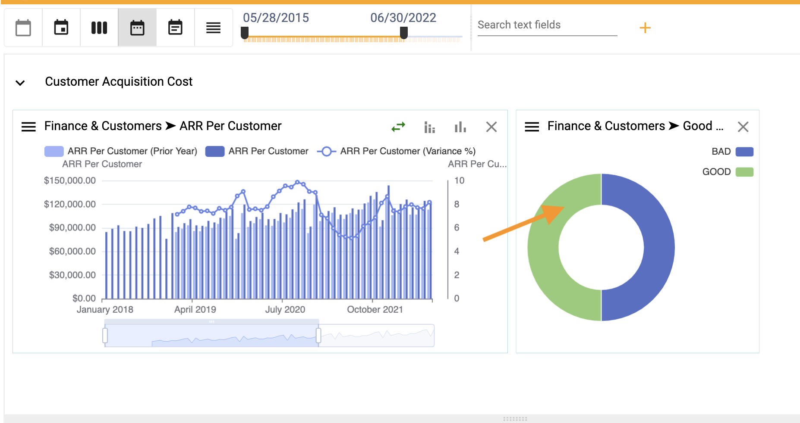
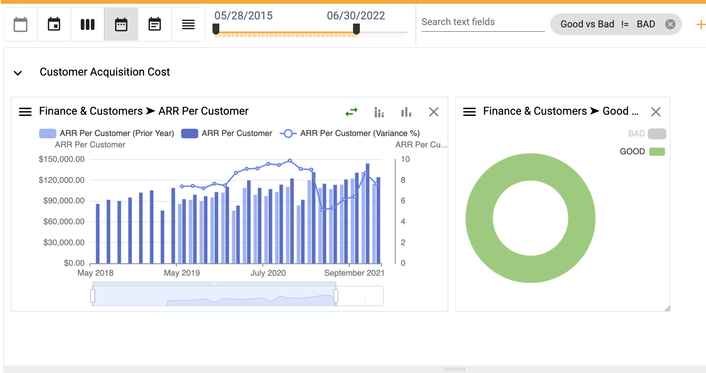
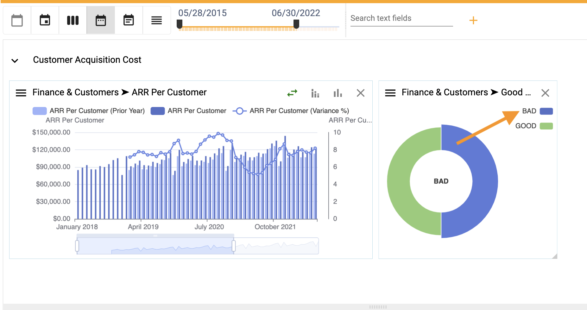

## How to cross-filter

Cross-filtering dashboards allows users to perform ad hoc analysis by filtering data in or out.

To filter data in:
1.  Click on one column, bar, slice or data point

</img>

2.  A filter is added for the selection portion

</img>

3.  To add the data back in, click on the slice again

</img>

To filter data out:
1.  Click a series block

</img>

2.  The category is removed entirely

</img>

3.  To add the category back in, click the series block again 

</img>
