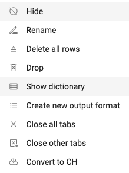

## Color formatting
You can specific the color of the font and the background of a field by editing the Format in the Collection Dictionary.

## Accessing the Dictionary
Right click on the title of the collection that contains the field you would like to format. Navigate to Show Dictionary.

</img>

Locate the field you'd like to format, and scroll over to the Format column. Input the formatting following the syntax below.

## Number formatting
| Original Value | Formatted Value | Formatting |
|----------------|-----------------|------------|
| 1234.59        | 1234.6          | ####.#     |
| 8.9            | 8.900           | #.000      |
| .631           | 0.6             | 0.#        |
| 12             | 12.0            | #.0#       |
| 1234.568       | 1234.57         | #.0#       |
| 12             | 00012           | 00000      |
| 123            | 00123           | 00000      |

## Conditional number formatting
You can apply a format to a number based on a condition. 
To indicate that a number format will be applied only if the number meets a condition that you have specified, enclose the condition in square brackets. 

[White Red][<-15000]$#,##0.00;[black lightgreen][>15000]$#,##0.00;$#,##0.00;
