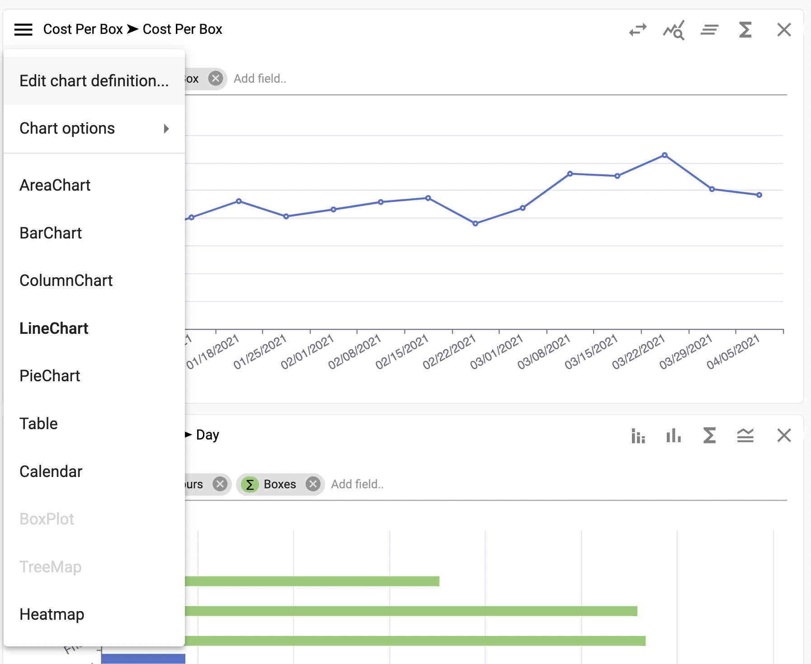
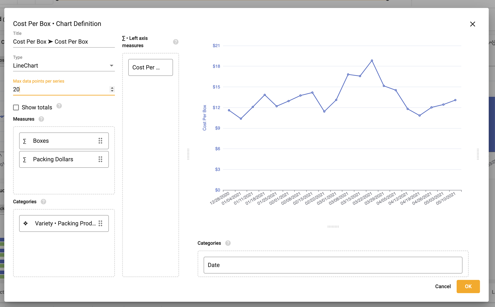
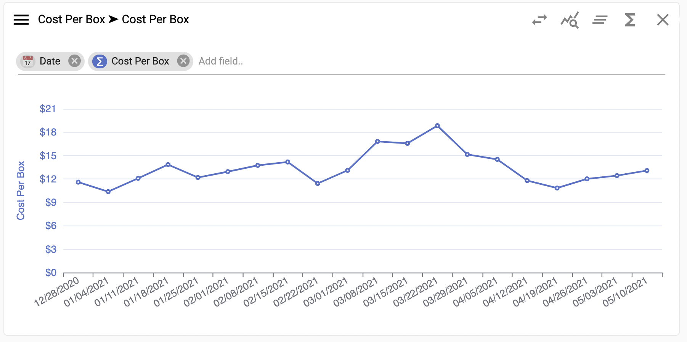

## Change the number of data points on a chart
Updating the number of data points on a chart can give users a more relevant view of the data. 

## How to change the number of data points on a chart 

To define the number of values (e.g. columns, points) on a chart:

1.	Select the chart menu ➔ **Edit chart definition**

</img>

2. Input the desired number of values 

</img>

3.  Select **OK**

</img>