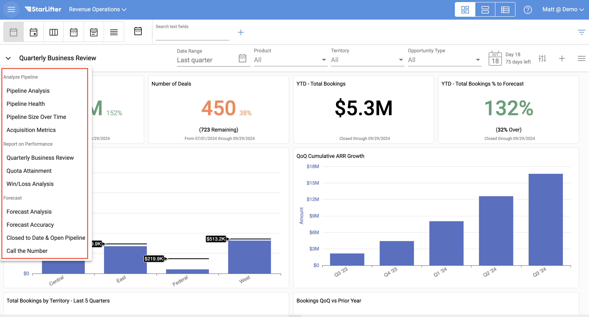
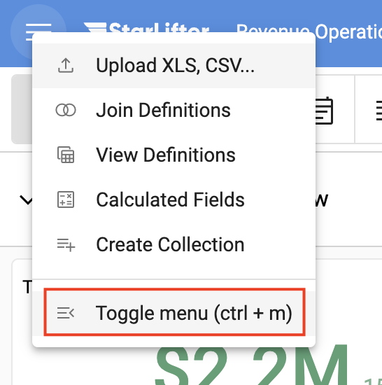
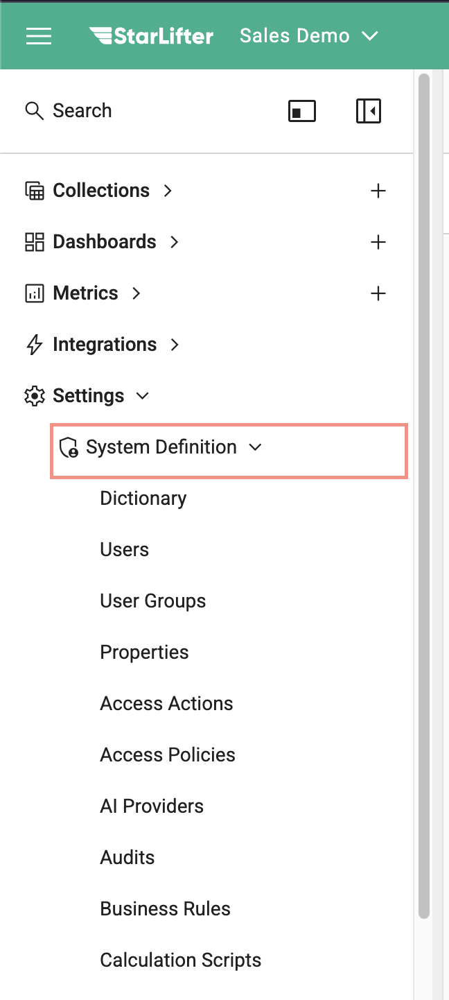
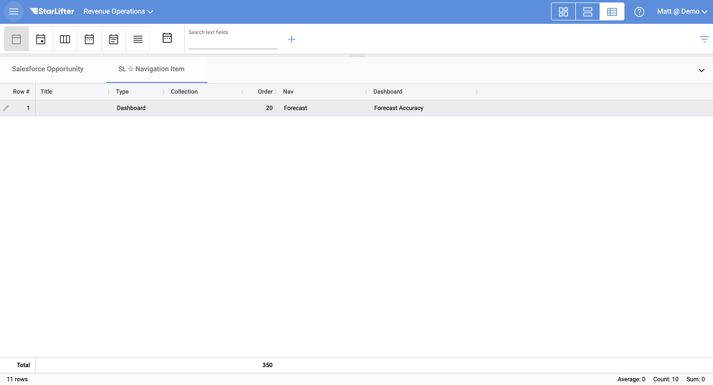
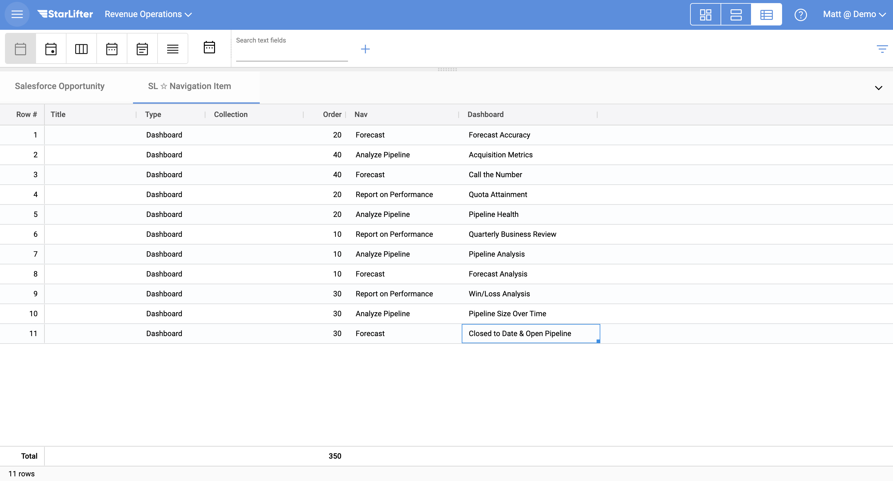

## Organize your dashboard

As your StarLifter org grows, it may make sense to organize your dashboards into groups.

</img>

### Organize your dashboard

1. From the menu at the upper left of the screen, select Toggle menu.

</img>

2. Select **SL ✩ Navigation Item** under the System Definition dropdown.

</img>

3. Right-click and select **Insert row**. Enter data into the fields below:

* **Type:** To organize your dashboard, select Dashboard
* **Nav:** The name of the group of dashboards
* **Dashbaord** Select the dashboard that belongs in the group

</img>

4. Add as many rows as there are dashboards, ensuring that each dashboard's group is listed in the Nav field.

</img>

To learn more or ask additional questions, head over to the [StarLifter Community](https://community.starlifter.io).
