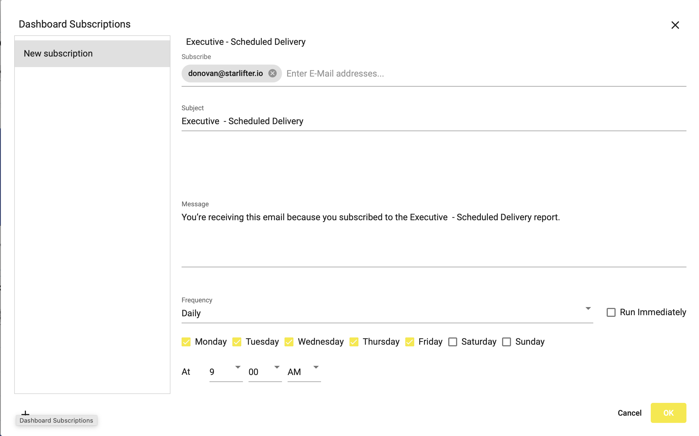

## How to create a subscription to a dashboard
How-to video link - https://youtu.be/34M9BJS9wjk

Subscribe users to dashboard to allow a PDF version of the dashboard to be emailed at scheduled times.

To create a dashboard subscription:

1.	Go the the desired dashboard and click the envelope icon in the upper right hand corner.

</img>

2.  Click the + in the lower right of the dialog and input:
* User(s) email address
* Email Subject
* Body of the email
* Frequency the email will be sent

</img>

3.  Check the "Run Immediately" to have the email sent immediately.

4.  Select **OK**
5.  The subscription is now saved and will be emailed at the scheduled time.

</img>

